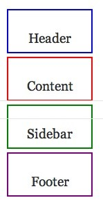
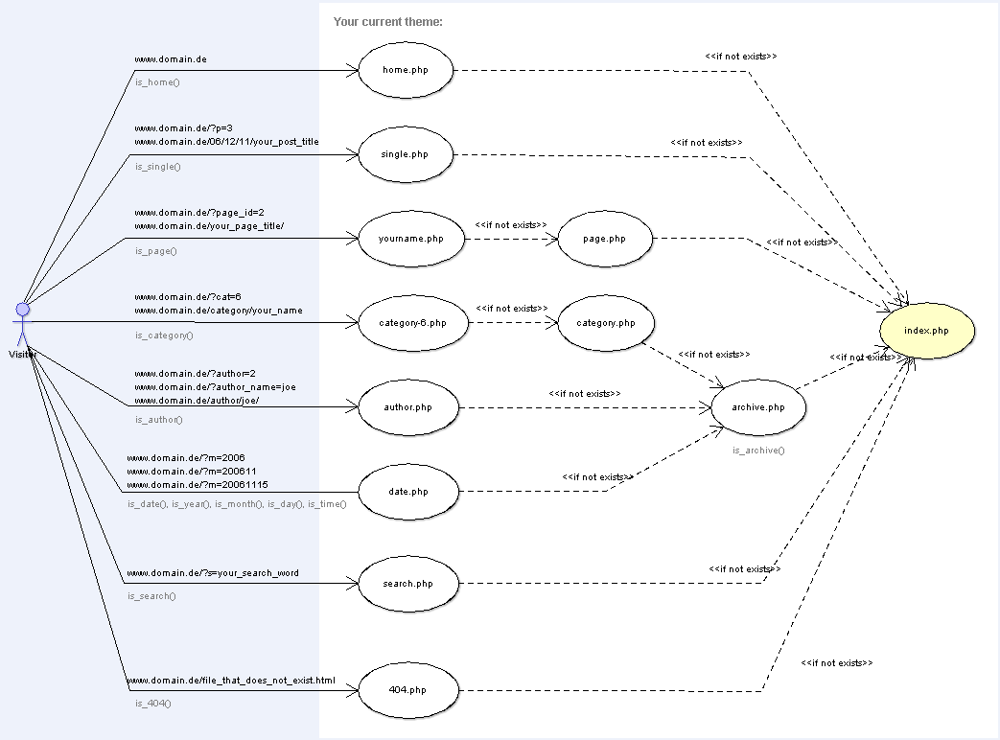
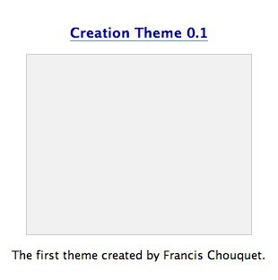
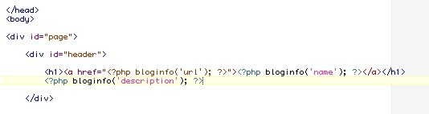
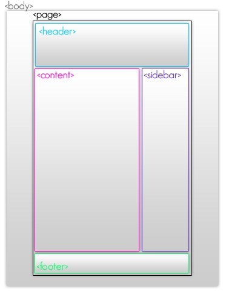
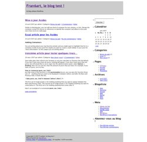
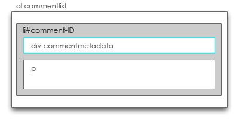
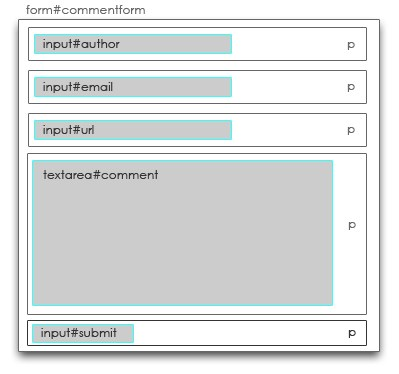

# Créez votre thème WordPress de A à Z

*19 MARS 2007 / 1 116 045 LECTURES  CSS, DEAAZ, LOOP-WORDPRESS, PHP, TEMPLATES, THEMES, TUTORIALS, WORDPRESS, XHTML  THEMESWP, WORDPRESS*

**Update du 5 Octobre 2011: les tutoriels ont beau datés de 2007, ils sont en cours de modifications pour y ajouter les fonctionnalités des dernières versions de WordPress. Quoi qu’il en soit, ils sont toujours d’actualité et ont été mis à jour plusieurs fois*.**

Peut-être que vous aimeriez créer votre propre thème pour votre blog et que vous ne savez pas trop comment vous y prendre ? Et bien, dans les semaines qui vont venir, je vais vous expliquer les différentes étapes à suivre, pas à pas, pour que n’importe qui (ou presque) puisse créer son propre thème. On va voir l’installation de WordPress sur votre ordinateur, les différents types de fichiers, leurs hiérarchies, et les interactions entre eux. On va ensuite apprendre à créer un thème relativement simple avec Photoshop et comment l’intégrer dans les différents fichiers. Enfin, on verra comment mettre tout ça en ordre grâce aux fichiers CSS.

Quoi qu’il en soit, quelques petits prérequis seront nécessaires. Mieux vaut avoir quelques connaissances en CSS (Cascading Style Sheets), XHTML, voire php et mysql. Mais pour ces deux derniers, si vous suivez bien les différentes étapes, vous ne devriez pas avoir besoin de tout comprendre. Ce thème va nous mener sur pas mal de semaines, donc je vous demanderai d’être patient 😉 On va évoquer les différentes étapes et aborder aussi bien le design que l’intégration d’un thème sur WordPress. Cet article sera mis à jour au fur et à mesure des articles publiés. Si, au cours de cette thématique vous avez des questions précises, posez-les via les commentaires pour que tout le monde puisse en profiter.

Je ne dis pas que la méthode que je vais présenter est la meilleure mais en tout cas, elle est celle que j’utilise !

« Stay tuned! » comme disent nos amis anglosaxons, les prochains jours et prochaines semaines vont être chargés !

Articles déjà en ligne:

* [Leçon 1: Installer WordPress en local sur votre ordinateur]()
* [Leçon 2: Pourquoi créer son propre thème ?]()
* [Leçon 3: Présentation des Templates]()
* [Leçon 4: Hiérarchie des Templates]()
* [Leçon 5: Création des Templates]()
* [Leçon 6: Le Header]()
* [Leçon 7: Introduction au Loop WordPress]()
* [Leçon 8: Le Loop WordPress, 2ème partie]()
* [Leçon 9: Le Loop WordPress, 3ème et dernière partie]()
* [Leçon 10: La sidebar: le formulaire de recherche]()
* [Leçon 11: La sidebar: Calendrier, Catégories et Pages]()
* [Leçon 12: La sidebar: Suite et fin]()
* [Leçon 13: Widgetisez votre sidebar pour WordPress 2.2]()
* [Leçon 14: Le footer]()
* [Leçon 15: Création de « sous-templates »]()
* [Leçon 16: Insertion des commentaires]()
* [Leçon 17: Navigation, page non trouvée et validation XHTML du ]()
* [Leçon 18: Présentation de la feuille de style (CSS)]()
* [Leçon 19: CSS: placement des différentes parties du thème]()
* [Leçon 20: CSS: customisation du header et du ]()
* [Leçon 21: CSS: customisation de la sidebar et du footer]()
* [Leçon 22: CSS: customisation des commentaires]()
* [Leçon 23: CSS: les liens]()

Et si ça vous intéresse, avec des amis, on a créé notre boutique de ventes de thèmes WordPress, Peaxl. [Venez jetez un oeil](http://peaxl.com/) ! 😉

Sources et références utilisées pour la création des différents tutoriels présentés ici:

* [Docs WordPress.org](http://codex.wordpress.org/Main_Page)
* [WPDesigner.com](http://www.wpdesigner.com/2007/02/19/so-you-want-to-create-wordpress-themes-huh/)
* [Lorelle on WordPress](http://lorelle.wordpress.com/2005/09/28/designing-a-wordpress-theme-from-scratch/)
* [Cre8d Design](http://www.cre8d-design.com/blog/2007/01/01/useful-resources-for-creating-a-wordpress-theme/)
* [boren.nu](http://boren.nu/archives/2004/11/10/anatomy-of-a-wordpress-theme/)
* [Chris J.Davis](http://www.chrisjdavis.org/2005/05/26/secrets-of-wp-theming-part-1/)
* [WordPress CSS Guides](http://www.tamba2.org.uk/wordpress/graphicalcss/)
* [The Tamba2 WordPress Guides](http://www.tamba2.org.uk/wordpress/)
* [1001 wordpressin loops](http://rhymedcode.net/1001-wordpression-loops/)
* [Matt read](http://mattread.com/2005/04/wordpress-is-not-php/)

[Fran6](http://www.fran6art.com/wordpress/creez-votre-theme-wordpress-de-a-a-z/)
============================================

## Création Thème WordPress | Tutorial 1: Installation de WordPress en local

*20 MARS 2007 / 393 707 LECTURES  DEAAZ, MAMP, THEMES, TUTORIALS, WORDPRESS, XAMMP  TUTORIELS*

Premier article d’une longue série sur la création d’un thème pour votre blog WordPress, nous allons commencer aujourd’hui par l’installation de WordPress en local sur votre ordinateur. Pourquoi faire ça ? Tout simplement pour pouvoir travailler librement, sans contrainte d’internet. Vous allez avoir sur votre ordinateur exactement les mêmes fichiers que sur le serveur qui héberge votre blog, et vous allez avoir une base SQL en local. Une fois votre thème terminé, vous n’aurez qu’à l’uploader vers le serveur et l’utiliser !

Il y a quelques temps, [j’avais parlé](http://www.fran6art.com/2006/12/05/creer-son-propre-theme-wordpress-lecon-n%c2%b01-travailler-en-local/) de la possibilité de ne travailler que les fichiers CSS et une version HTML du blog. Cette utilisation en local est intéressante dans la mesure où l’on ne veut travailler que le style pour un thème existant. J’ai déjà essayé de travailler de cette manière et j’ai trouvé ça fastidieux. Le mieux est d’installer le blog en entier.

Vous allez donc devoir installer Apache, MySQL et Php sur votre ordinateur pour pouvoir héberger votre blog. Beaucoup d’ordinateurs possèdent déjà ces outils et des logiciels vont s’occuper du reste. Ces logiciels sont [XAMPP pour Windows et Linux](http://www.apachefriends.org/fr/xampp.html), et [MAMP pour Mac](http://www.mamp.info/). Malheureusement pour les windowsiens, je n’expliquerai ici que l’installation sur Mac, vu que c’est celle que j’ai effectué. Cependant, vous trouverez ici un super tutoriel en anglais qui vous explique la marche à suivre sous Windows XP. L’installation ne diffère pas beaucoup de MAMP. N’hésitez pas à poser vos questions si vous avez des soucis lors de l’installation de ces logiciels.

Alors, pour les Macs, comment on installe WordPress ? Tout d’abord, téléchargez [MAMP, version normale](http://www.living-e.de/de/produkte/MAMP-PRO/download/download.php). Installez le logiciel et notamment le widget qui figure dans le dossier. Une fois le widget installé, vous allez pouvoir l’utiliser pour démarrer les serveurs.

Si vous êtes sous sous 10.3, démarrez les serveurs en lançant tout simplement l’application MAMP.

Une fois les serveurs lancés, vous allez cliquer sur l’icone « Open Start Page ». Si tout se passe comme prévu, une page va s’ouvrir sur votre navigateur préféré et va vous donner toute une série d’informations concernant votre base MySQL. Notez ces infos (hôte, port, utilisateur et mot de passe). Ces infos devront être recopiés par la suite dans le fichier config.php.

Un peu plus haut sur cette page, vous avez un lien pour aller sur phpMyAdmin. Cliquez sur le lien. Vous allez devoir créer une base pour héberger votre blog WordPress. Pour cela rien de plus simple ! Sous l’intitulé « Créer une base de données, vous allez écrire « wordpress », laisser « Interclassement » et cliquer sur « Créer ». Votre base va alors être listée dans la colonne de gauche avec d’autres bases existantes. Refermez cette fenêtre, votre base est créee.

Maintenant, on va installer WordPress. Allez télécharger la dernière version sur [WordPress Francophone](http://www.wordpress-fr.net/telechargements/). Décompressez le dossier, renommez-le « wordpress » et allez le placer dans le dossier Applications>MAMP>htdocs. A partir de maintenant, les étapes seront les mêmes que pour installer WordPress sur un serveur à distance.

* Modifiez le fichier wp-config-sample.php avec les données récupérées sur la page de MAMP. Pour cela, utilisez votre éditeur de texte préféré. Vérifiez que l’extension du fichier reste bien .php. Normalement, ça devrait donner ça après modification:

    define('DB_NAME', 'wordpress');  // Le nom de la base de donnees
    define('DB_USER', 'root');   // Votre identifiant MySQL
    define('DB_PASSWORD', 'root'); //...et votre mot de passe
    define('DB_HOST', 'localhost:8888');  // Dans la plupart des cas, vous n'aurez pas a modifier cette dernière ligne

Il est fort possible que vous ayez 8889 comme port, mais je pense qu’il vous faudra le modifier à 8888 pour que ça marche. Vérifiez l’adresse donnée lors de l’ouverture de la page d’accueil de MAMP qui fournit les infos. Dans l’URL, vous aurez le bon port à utiliser. Ensuite, vous allez lancer le fichier intall.php via cette adresse:  [http://localhost:8888/wordpress/wp-admin/install.php](http://localhost:8888/wordpress/wp-admin/install.php) . Le contenu de la base sera créé et votre blog installé ! Récupérez les infos de login et connectez-vous à votre blog ! Celui-ci est dorénavant visible à cette adresse: [http://localhost:8888/wordpress/](http://localhost:8888/wordpress/).

Maintenant, on va pouvoir commencer à taper dans le dur et aller modifier les différents fichiers pour créer notre propre thème !!

Tutoriel suivant : « 2. pourquoi créer son propre thème ? »

Et si ça vous intéresse, avec des amis, on a créé notre boutique de ventes de thèmes WordPress, Peaxl. [Venez jetez un oeil](http://peaxl.com/) ! 😉

Sources: [Michael Doig](http://michaeldoig.net/?p=4) et [Ben Bleikamp](http://bleikamp.com/2006/11/16/wordpress-on-a-mac)

[Fran6](http://www.fran6art.com/tutoriels/creation-theme-wp-lecon-1-installation-de-wordpress-en-local/)

=========================

## Création Thème WordPress | Tutorial #2: Pourquoi créer son propre thème ?

*23 MARS 2007 / 161 487 LECTURES  CSS, DEAAZ, PHOTOSHOP, PHP, TEMPLATES, THEMES, TUTORIALS, WORDPRESS, XHTML  TUTORIELS*

Avant d’entrer dans le vif du sujet et attaquer les templates, je vous voudrais commencer par répondre à cette question simple mais importante: Pourquoi créer son propre thème WordPress ? Il existe déjà beaucoup de thèmes existants, dont de nombreux [de très bonne qualité](http://www.fran6art.com/2007/01/23/les-10-meilleurs-themes-gratuits-pour-wordpress/). De plus, se lancer dans une telle aventure demande pas mal de temps et d’énergie… Oui, mais il y a aussi pas mal d’avantages à créer son propre thème WordPress et ceux-ci ne sont pas négligeables. Selon les développeurs de WordPress, créer son propre thème:

C’est créer son propre univers, avoir un blog avec le look que l’on veut,
D’un point de vue technique, mettre les mains dans le cambouis, c’est mieux comprendre les templates, les template tags ou encore le WordPress Loop et en tirer profit. Ainsi, vous pourrez customiser votre blog comme vous le souhaitez, que ce soit au niveau du look mais aussi des fonctionnalités,
C’est aussi la possibilité de créer des environnements qui n’existent pas encore chez les thèmes proposés par WordPress,
Possibililté aussi de faire des « releases » publiques du ou des thèmes créés,
C’est une excellente opportunité pour mieux connaître et comprendre le XHTML, CSS et PHP,
C’est un très bon travail de créativité et c’est fun !
C’est vrai que c’est très intéressant. On comprend vraiment beaucoup de choses et on peut utiliser son blog au maximum. Pour cela, pas forcément besoin de beaucoup de connaissances techniques, mais une bonne compréhension du fonctionnement d’un blog et le minimum de connaissances en XHTML, CSS et PHP sont nécessaires pour ne pas être perdu très rapidement, ni frustré de ne pas arriver à ce qu’on veut.

Les prochaines leçons vont être assez difficiles à comprendre pour les néophytes. On va beaucoup parler codage, PHP, templates, template tags, requêtes et WordPress loop. Je ne suis pas moi-même un développeur web, mais un créatif. J’essayerai donc de rester simple dans mes explications pour faire en sorte que le plus grand nombre d’entre vous comprennent facilement.

Ce passage par la compréhension du fonctionnement d’un thème n’est pas obligatoire. Vous pouvez très bien commencer directement avec la customisation d’un thème existant. J’ai longtemps hésiter entre les deux possibilités et finalement j’ai choisi de tout expliquer. Même si plus tard vous préférez partir directement d’un thème existant comme [k2](http://getk2.com/) ou [kubrick](http://binarybonsai.com/kubrick/), vous pourrez facilement les modifier car vous aurez compris les principes des templates et leur fonctionnement. D’ailleurs, WordPress recommande à tous de partir d’un thème éprouvé comme les deux thèmes standards figurant par défaut dans votre blog. Ces thèmes ont faits leurs preuves et sont bien optimisés. Mais partir de rien ou tout du moins comprendre le fonctionnement complet de WordPress est un gros plus et c’est surtout une aventure super intéressante. Pour moi, les semaines et mois à venir vont être très passionnantes, j’espère qu’il en sera de même pour vous. Je vais essayer de poster un à deux articles par semaine sur la création du thème, dépendant de mes disponibilités. Ce thème, c’est le cas de le dire, va prendre pas mal de place sur le blog pendant un bon moment. J’en fais une priorité. J’essaierai de faire en sorte que ça n’est pas trop d’incidence sur les autres sujets. Je vais peut-être faire un peu moins de veille pour avancer de manière régulière sur la création de thème.

Vos commentaires, idées et remarques sont bien entendues les bienvenues. Une fois la partie « technique » abordée, nous passerons rapidement à la partie créatrice avec beaucoup de CSS et de Photoshop. ce qui risque, encore là, de nous tenir en haleine un bon moment !!

Tutoriel suivant: A la découverte des templates !

Et si ça vous intéresse, avec des amis, on a créé notre boutique de ventes de thèmes WordPress, Peaxl. [Venez jetez un oeil](http://peaxl.com/) ! 😉

[Fran6](http://www.fran6art.com/tutoriels/creation-theme-wp-lecon-2-pourquoi-creer-son-propre-theme/)

=========================

## Création Thème WordPress | Tutorial #3: Présentation des templates

*26 MARS 2007 / 216 998 LECTURES  CSS, DEAAZ, LOOP-WORDPRESS, PHP, TEMPLATES, THEMES, TUTORIALS, WORDPRESS, XHTML  TUTORIELS*

Aujourd’hui, nous allons commencer à entrer dans le vif du sujet. Je vais essayer de ne pas faire d’articles trop long pour que vous puissiez assimiler le tout au fur et à mesure.

Si vous tombez par hasard sur cet article, mieux vaut que vous commenciez par le début, sinon vous risquez d’être rapidement perdu…

### Présentation des fichiers templates:

Donc, aujourd’hui nous allons commencer à s’intéresser de plus près au blog sous WordPress et notamment à son thème et à ses templates. Tout d’abord, il faut savoir qu’un thème pour WordPress est composé de 3 éléments:

* La ou les **feuilles de style**: c’est ce qui va donner le style, l’apparence que vous voulez à votre blog. Ce sont ce qu’on appelle les CSS, les Cascading Style Sheets.
* Les **images**: on va trouver dans le thème toutes les images utilisées par la feuille de style pour habiller votre blog.
* Les **Templates**: ce sont les fichiers, les différents éléments en PHP, qui vont composer la page web de votre blog visuellement. Les plus connus sont le header, index, sidebar et footer:

Remarque: dans le schéma ci-dessus, on assimilera pour l’instant le contenu, « Content » au fichier index.php, étant donné que l’on ne va aborder que celui-ci pour le moment. Sachez cependant que le contenu peut se référer à d’autres fichiers que l’index.

Voyons un peu plus dans le détail, ce que comportent ces 4 fichiers PHP:

* **Le Header** (header.php): il contient toutes les infos figurant en haut de votre blog. On y trouve notamment les infos contenues par la balise <head> comme le DocType, les balises META, les liens vers les feuilles de styles CSS, ainsi que d’autres infos utiles pour un bon référencement de votre blog. En bref, le header héberge les infos importantes pour un bon affichage de votre blog dans un navigateur. Enfin, le header comporte l’entête de votre blog, avec son titre et sa description.
* **L’index** (index.php): il contient le contenu de votre blog, vos articles et différentes pages. En fait, il ne le contient qu’indirectement puisque c’est dans le Loop WordPress que l’on va trouver les règles qui vont déterminer ce qui doit être affiché dans l’index. Mais nous parlerons du Loop dans un prochain tutoriel.
* **La sidebar** (sidebar.php): C’est la colonne qui va afficher différentes informations comme la blogroll, les derniers articles, les derniers commentaires, soit tout l’ensemble de widgets pour une meilleure navigation dans le blog. Elle pourra se trouver à gauche, à droite ou au-dessous du contenu. D’un point de vue codage, elle sera située entre le contenu et le footer.
* **Le footer** (footer.php): Situé en bas de page (comme son nom l’indique), il « ferme » la page et contient différentes informations comme celles de copyright, de l’auteur ou encore de la plateforme utilisée.
Dans le prochain article, nous allons voir comment sont organisés ces fichiers templates. Je ne veux pas trop vous assomer d’un coup! Je préfère faire plusieurs petits articles au début plutôt qu’un seul gros, histoire que l’assimilation soit plus facile !

N’hésitez pas à poser des questions ou à faire des remarques.

Tutoriel suivant: 4. Hiérarchie des templates

Et si ça vous intéresse, avec des amis, on a créé notre boutique de ventes de thèmes WordPress, Peaxl. [Venez jetez un oeil](http://peaxl.com/) ! 😉

[Fran6](http://www.fran6art.com/tutoriels/creation-theme-wordpress-tutorial-3-presentation-des-templates/)

=========================

## Création Thème WordPress | Tutorial #4: Hiérarchie des templates

*27 MARS 2007 / 229 794 LECTURES  CSS, DEAAZ, LOOP-WORDPRESS, PHP, TEMPLATES, THEMES, TUTORIALS, WORDPRESS, XHTML  TUTORIELS*

Si vous commencez la série de tutoriels consacrés à la création d’un thème pour WordPress de A à Z, je vous conseille de commencer par le début, sinon, vous risquez d’être rapidement perdu !

Dans le dernier tutoriel, nous avons vu quels étaient les principaux templates utilisés dans WordPress, mais ces fichiers header, index, sidebar et footer, bien qu’étant les plus connus et répandus, ne sont pas les seuls reconnus par WordPress. Voici la liste de tous les templates utilisables avec un blog WordPress:

home.php, single.php, yourname.php, page.php, category.php, category-6.php, author.php, date.php, search.php, 404.php, archive.php et index.php. Selon la page a afficher, on aura accès à un template différent. Dans le schéma du précédent tutoriel, on parlait de « Content ». Ce contenu sera différent selon la page. On pourra faire appel à l’index.php mais aussi à single.php, page.php, etc.

Tous ces fichiers templates sont reliés entre eux sous une forme de hiérarchie. Le graphique suivant vous montre cette hiérarchisation des templates:

Pour bien comprendre la hiérarchie des templates sous WordPress, il suffit de comprendre le raisonnement suivant: Tout template créé réfère à index.php. C’est le template, le fichier central. Ca veut dire que si un visiteur arrive directement sur la page d’un article (single.php) et que ce fichier n’existe pas, il sera directement renvoyé vers le fichier index.php. Ainsi, vous pourrez créer autant de templates que vous voudrez dans la liste proposée par ce schéma, il vont tous être sous la « responsabilité » de l’index.php.

Cependant, lorsque l’on crée un thème pour WordPress, il est tout à fait possible de n’utiliser que le fichier index.php et mettre toutes les informations pour votre blog dedans, mais c’est une manière de procéder trop réductrice et ne permettra pas une optimisation et une customisation du blog aussi intéressante qu’avec différents fichiers. Selon moi, la meilleure manière de faire va être de partir des 4 fichiers présentés plus haut et de venir les compléter ensuite avec d’autres templates apportant une info plus précise comme category.php, voire même category-6.php qui va afficher les articles pour la catégorie 6 par exemple.

Mais comment sont reliés entre eux ces différents fichiers ? Et bien, la communication va se faire par le biais de Template Tags, des lignes de code qui vont appeler d’autres fichiers ou bien d’autres informations issues de la base de donnée. Nous étudierons ces template tags plus dans le détail au moment de la création du thème. Mais pour bien comprendre, prenez ces tags comme des liens entre les fichiers PHP et la base de données.

Ce n’est pas forcément évident d’assimiler ces termes comme ça. C’est pour ça que dès le prochain article, nous allons commencer la création du thème. Nous allons créer les différents templates et les relier entre eux grâce aux template tags. Ensuite, une fois la structure de base des fichiers établie, nous allons « remplir » chacun de ses fichiers pour créer notre thème. Donc, même si c’est pas très facile de comprendre tous ces termes, il était important de les présenter préalablement à la création du thème, pour partir sur de bonnes bases.

Donc, préparez-vous, la prochaine fois, on attaque le thème !

N’hésitez pas à poser des questions ou à faire des remarques.

Tutoriel suivant: 5. Création des templates

Et si ça vous intéresse, avec des amis, on a créé notre boutique de ventes de thèmes WordPress, Peaxl. [Venez jetez un oeil](http://peaxl.com/) ! 😉

[Fran6](http://www.fran6art.com/tutoriels/creation-theme-wordpress-tutorial-4-hierarchie-des-templates/)

=========================

## Création Thème WordPress | Tutorial #5: Création des Templates

*2 AVRIL 2007 / 280 214 LECTURES  CSS, DEAAZ, LOOP-WORDPRESS, PHP, TEMPLATES, THEMES, TUTORIALS, WORDPRESS, XHTML  TUTORIELS*

Aujourd’hui, nous allons entrer dans le vif du sujet puisque nous allons commencer la création de notre thème en créant le dossier du thème ainsi que les différents templates de base que nous allons utiliser. Si vous découvrez la série de tutoriels aujourd’hui, je vous conseille fortement de commencer par le début sinon vous risquez de ne pas tout comprendre.

### 1. Création du dossier du thème

Vous connaissez déjà sûrement où se situent les dossiers pour les différents thèmes que vous avez sur votre serveur, mais un petit rappel ne sera pas de trop. Le dossier des thèmes se situe sous: WordPress > wp_content > themes. Au départ, nous n’allons créer nos différents fichiers de base, l’index.php, le header.php, le sidebar.php, le footer.php et la feuille de style style.css.

* Vous allez donc commencer par démarrer les serveurs php et apache si vous travaillez en local.
* Créez ensuite un dossier sous l’emplacement décrit ci-dessus. On va l’appeler « Creation Theme« .
* Ouvrez votre éditeur de texte préféré et enregistrez le fichier en l’intitulant index.php. Faîtes de même avec les autres templates ainsi qu’avec la feuille de style, style.css.
* Vous devez maintenant avoir 5 fichiers sous le dossier « Creation Theme », lui-même sous le dossier « Themes » de WordPress.
* Nous allons maintenant travailler sous ces différents fichiers et les renseigner au minimum au fur et à mesure.

### 2. Création du header et de l’index

#### 2.1. Création du template header.php

Nous allons commencer par le **HEADER** (header.php) et l’**INDEX** (index.php). Pourquoi ? Parce que c’est le header qui contient les informations de base qui vont permettre à la page web de bien s’afficher dans le navigateur. Le header comprend notamment:

* Le DOCTYPE, qui nous fournit les informations sur le codage utilisé par la page web,
* La balise HEAD et tout ce qu’elle comporte: les balises META, le titre du blog, le lien vers la feuille de style et vers les flux RSS.
* L’ouverture de la balise BODY.

Toutes ces informations sont les bases pour créer votre blog. Sans le doctype, le navigateur ne saura pas quoi ni comment afficher la page web. Sans la balise HEAD et ses différentes infos, le navigateur ne saura pas non plus quel type de code utiliser, comment s’appelle le blog, où sont les infos de style et s’il y a un flux RSS. Bref, c’est la base de la base. Sans ça, on ne va nulle part.

Ensuite, on va travailler tout de suite dans l’index parce que c’est le fichier central du thème. C’est chez lui que l’on va dire où aller chercher l’information. C’est donc dans ce template que l’on va dire d’aller dans le header.php pour trouver les informations de base pour notre thème.

Ouvrez donc votre template header.php et saisissez-y les données suivantes. Ce sont les données de base à renseigner. On verra par la suite comment les améliorer et les optimiser. Mais pour le moment, on va garder quelque chose de simple, juste pour concevoir l’architecture de notre thème:

    <!DOCTYPE html PUBLIC "-//W3C//DTD XHTML 1.0 Transitional//EN" "http://www.w3.org/TR/xhtml1/DTD/xhtml1-transitional.dtd">
    <html xmlns="http://www.w3.org/1999/xhtml">
        <head profile="http://gmpg.org/xfn/11">
            <title>
                <?php bloginfo('name') ?>
                <?php if ( is_404() ) : ?>
                    &raquo;
                <?php _e('Not Found') ?>
                <?php elseif ( is_home() ) : ?>
                    &raquo;
                <?php bloginfo('description') ?>
                <?php else : ?>
                <?php wp_title() ?>
                <?php endif ?>
            </title>
            <meta http-equiv="Content-Type" content="<?php bloginfo('html_type'); ?>; charset=<?php bloginfo('charset'); ?>" />
            <meta name="generator" content="WordPress <?php bloginfo('version'); ?>" /> <!-- leave this for stats -->
            <link rel="stylesheet" href="<?php bloginfo('stylesheet_url'); ?>" type="text/css" media="screen" />
            <link rel="alternate" type="application/rss+xml" title="RSS 2.0" href="<?php bloginfo('rss2_url'); ?>" />
            <link rel="alternate" type="text/xml" title="RSS .92" href="<?php bloginfo('rss_url'); ?>" />
            <link rel="alternate" type="application/atom+xml" title="Atom 0.3" href="<?php bloginfo('atom_url'); ?>" />
            <link rel="pingback" href="<?php bloginfo('pingback_url'); ?>" />
                <?php wp_head(); ?>
                <?php wp_get_archives('type=monthly&format=link'); ?>
                <?php //comments_popup_script(); <?php wp_head(); ?>
        </head>
    <body>

On retrouve dans ces informations tout ce que l’on a évoqué ci-dessus. La balise titre est déjà quelque peu optimisée mais plus tard, je conseillerai un format optimal pour un meilleur référencement par le biais d’un plugin incontournable. Ces informations se terminent par l’ouverture de la balise BODY et donc le contenu de notre page web. Vous allez comprendre un peu plus tard pourquoi on l’a ouvert ici.

N’oubliez pas d’enregistrer votre fichier et ouvrez maintenant le template index.php.

#### 2.2 Création du template index.php et présentation des template tags

En fait, l’index va nous donner les instructions pour nous permettre d’aller chercher les informations au bon endroit. Ici, on va commencer par lui dire d’aller chercher les infos du header dans le template header,php. Pour cela, on va utiliser des **template tags**. Les template tags sont des petits morceaux de code en PHP qui cont relier les fichiers entre eux. Ici, ce petit bout de code va être inséré dans l’index et va nous dire que l’info concernant le header se trouve dans le fichier header.php. Cette ligne de code c’est la suivante:

    <?php get_header(); ?>

On va donc aller chercher le header de cette façon pour l’incorporer d’une certaine manière à l’index. Comme je l’ai dit plus tôt, on pourrait très bien n’utiliser que l’index et mettre toutes les infos dedans, mais je trouve que pour une meilleure organisation du thème, mieux vaut avoir les fichiers séparés. On pourra mieux les optimiser séparément.

Reparlons ici de l’ouverture des balises HTML et BODY sous le header. Etant donné que l’on va aller chercher ces informations à partir de l’index, il est important que l’on pense à refermer ces balises. Imaginons toutes les infos citées ci-dessus dans l’index, il nous faudrait penser à refermer ce qui n’est pas refermé. C’est le cas des balises HTML et BODY. On va donc les fermer dans le template index.php:

    </body> </html>

Dans l’index, saisissez donc ces trois lignes de code:

    <?php get_header(); ?> <!-- ouvrir header,php -->
    </body>
    </html>

A droite de la requête PHP, vous pouvez voir un commentaire. Ces commentaires sont toujours utiles pour se repérer. Utilisez-les autant de fois qu’il vous est nécessaire pour y voir plus clair et utilisez les signes <!– et –> pour les encadrer.

Enregistrez votre template index.php.

#### 2.3 Création de la feuille de style, style.css

Ouvrez le fichier CSS créé précédemment et saisissez-y les informations suivantes:

    /*
    Theme Name: Creation Theme
    Theme URI: http://www.fran6art.com/
    Description: The first theme created by Francis Chouquet.
    Version: 0.1
    Author: Francis Chouquet
    Creation Theme by Francis Chouquet || http://www.fran6art.com
    */

Vous pouvez modifier ces informations en les remplaçant par celles que vous voulez. Ces quelques lignes vont donner les infos de base de votre feuille de style. C’est notamment elles qui vont permettre l’affichage de votre thème dans l’administration de WordPress.

Enregistrez votre fichier et fermez maintenant votre éditeur de texte et allez sur l’administration de votre blog, onglet « Thème » ou « Présentation » selon la version de WordPress que vous avez. Si vous avez bien tout fait comme je vous l’ai indiqué ci-dessus, vous devez voir apparaître le nouveau thème créé:

Sélectionnez-le et « affichez le site ». Pour le moment, vous n’avez qu’une page blanche mais votre titre apparaît déjà dans la barre d’entête de votre navigateur.

Si vous souhaitez visualiser une image à vous, il faut que cette image fasse 300 x 240 pixels et qu’elle se nomme screenshot.png. Pensez également à l’insérer dans le dossier de votre thème.

Dans le prochain billet, nous allons voir comment remplir le header pour voir apparaître le titre et la description du blog. On s’arrête donc pour aujourd’hui et je crois vraiment que c’est suffisant ! 😉
Bon week-end

Tutoriel suivant: 6. Le Header

Et si ça vous intéresse, avec des amis, on a créé notre boutique de ventes de thèmes WordPress, Peaxl. [Venez jetez un oeil](http://peaxl.com/) ! 😉

[Fran6](http://www.fran6art.com/tutoriels/creation-theme-wordpress-tutorial-5-creation-des-templates/)

=========================

## Création Thème WordPress | Tutorial #6: le Header

*12 AVRIL 2007 / 209 160 LECTURES  CSS, DEAAZ, LOOP-WORDPRESS, PHP, TEMPLATES, THEMES, TUTORIALS, WORDPRESS, XHTML  TUTORIELS*

Ce tutoriel est le sixième d’une série articles sur la création d’un thème pour WordPress de A à Z. Si vous prenez le train en cours, je vous conseille fortement de commencer par le premier tutoriel de la série.

Aujourd’hui, nous allons mettre du contenu dans nos templates. On va commencer par faire apparaître le titre et la description du blog en haut de la page. Ces informations vont être « stockées » dans le Template header.php. Vous vous souvenez sûrement que dans le précédent tutoriel, on a « dit » à l’index, via un template tag, d’aller chercher dans le header les informations à afficher sur la page web. On y a ajouté les différentes informations d’entête de la page web, sous les balises head, mais on n’a pas encore mis quoi que ce soit dans les balises body, celles qui affichent le corps de texte.

###1. Insertion du titre du blog

On va tout d’abord ajouter le titre du blog, que l’on va appeler par le biais d’une commande PHP:

    <?php bloginfo('name'); ?>

Par cette requête, on va appeler le nom du blog dans la base de données, tel qu’on l’a écrit dans l’administration de WordPress. On va chercher les informations du blog (bloginfo) et à l’intérieur de celles-ci, on va chercher le nom du blog (name).

Insérez donc cette ligne de code sous l’ouverture de la balise body. Sauvegardez et allez voir ce qui se passe sur votre navigateur préféré. Le titre du blog apparaît en haut à gauche.

On va lui donner un peu de style à ce titre et on va lui appliquer la balise H1 pour avoir un titre plus gros. Pour cela, ajouter

    <h1>

Devant la requête php et

    </h1>

A la fin de cette même requête. Sauvegardez et rafraîchissez une nouvelle fois le navigateur. Le titre du blog apparaît maintenant en plus gros.

Ce titre, on va lui donner un lien. C’est le titre du blog, et donc en cliquant dessus, le visiteur pourra retourner à la « homepage » du blog. Pour ce faire, on va ajouter la ligne de code suivante à l’intérieur de ce que nous venons d’écrire.

    <h1><a href="<?php bloginfo('url'); ?>"><?php bloginfo('name'); ?></a></h1>

On a ici les informations classiques XHTML pour un lien hypertexte et comme destination du lien, on va aller chercher l’information dans la base, toujours sous les informations du blog (bloginfo) et cette fois-ci, on va récupérer l’URL du blog (‘url’). Ajoutez donc ce code, sauvegarder et rafraîchissez le navigateur. Le titre du blog est maintenant souligné et de couleur bleu. Il s’est transformé en lien.

### 2. Insertion de la description du blog

On va maintenant ajouter la description du blog sous le titre. Si vous avez compris le fonctionnement les tags PHP ci-dessus, vous devez déjà avoir trouvé comment on va afficher la description du blog: tout simplement en ajoutant une commande PHP qui va nous permettre d’aller dans les informations du blog (bloginfo) et d’y récupérer la description du blog, appelée tout simplement ‘description’. On obtient alors la ligne de code suivante:

    <?php bloginfo('description'); ?>

On va venir la mettre sous la ligne de code du titre du blog. Sauvegarder et rafraîchissez votre navigateur. La description du blog apparaît maintenant sous son titre.

### 3. Préparation de la mise en forme

Pour terminer ce tutoriel, on va s’intéresser à la mise en forme du header. Par la suite, quand on étudiera les feuilles de style, les CSS, on va vouloir modifier l’apparence du header. Et pour se faire, on va donc devoir créer des balises de mise en forme, div ou span. Je ne vais pas expliquer ici comment fonctionnent les CSS. Si vous ne les connaissez pas, je conseille un de ces livres, très bien faits et qui vous aideront rapidement à comprendre ce que sont les CSS.

Donc, pour revenir à notre mise en forme, on va « entourer » le titre et sa description d’une DIV, histoire de pouvoir travailler sur la mise en forme par la suite. Bien comprendre ici la notion de « boîte » ou de « cadre » qui enveloppe les informations. Cette DIV, on va l’appeler « header », tout simplement et on va la placer avant et après les informations du header. Ca nous donne ça:

    
 <!-- informations du blog --> 

Pourquoi une « id » ? Parce que les « id » sont uniques. On utilisera les « class » pour les articles par exemple, car il n’y aura pas qu’un seul article.

Sauvegarder votre header.php.

Dernière petite chose, on va en profiter pour créer la « boîte », la DIV qui va envelopper l’ensemble de la page web. Dans les CSS, on aura des infos qui seront valables pour l’ensemble de la page web, donc il est important d’avoir cette « boîte » qui va envelopper toute la page web et ainsi toutes les autres boîtes qui intéresseront uniquement à des parties de la page web. Cette boîte ou DIV, on va lui donner le nom « page », tout simplement. On va la placer sous la balise body, dans le header comme suit:

    

et on va la refermer dans le template index, juste au-dessus de la balise de fermeture du body, en insérant le code

Votre code dans le header et sous la balise body doit ressembler à ça maintenant:

Sauvegardez vos fichiers. On vient de créer l’enveloppe de la page web pour les futures mises en forme.

Voilà, c’est tout pour aujourd’hui !! La prochaine fois, on va attaquer le contenu, c’est-à-dire les articles.

N’hésitez pas à poser des questions ou à faire des remarques !

Tutoriel n°7: « Introduction au loop WordPress »

Et si ça vous intéresse, avec des amis, on a créé notre boutique de ventes de thèmes WordPress, Peaxl. [Venez jetez un oeil](http://peaxl.com/) ! 😉

[Fran6](http://www.fran6art.com/tutoriels/creation-theme-wordpress-tutorial-6-le-header/)

=========================

## Création Thème WordPress | Tutorial #7: Introduction au Loop WordPress

*18 AVRIL 2007 / 162 079 LECTURES  CSS, DEAAZ, LOOP-WORDPRESS, PHP, TEMPLATES, THEMES, TUTORIALS, WORDPRESS, XHTML  TUTORIELS*

Ce tutoriel est le septième d’une série articles sur la création d’un thème pour WordPress de A à Z. Si vous prenez le train en cours, je vous conseille fortement de commencer par le premier tutoriel de la série.

La dernière fois, nous avons commencé à voir quelque chose sur le navigateur. On a bossé sur le titre du blog et sa description. Maintenant, on va « attaquer » le contenu de notre blog, c’est-à-dire le titre de l’article, son contenu et aussi les informations « postmetadata » que sont la date, le nombre de commentaires, les catégories ou encore l’auteur de l’article. Aujourd’hui, on commence avec les titres et si tout va bien, demain, on fera le contenu et vendredi les postmetadata. Ce n’est pas que je ne veuille pas tout vous coller d’un seul coup, mais vous allez voir que rien que la présentation du loop et l’insertion des titres des articles, ça fait long et déjà pas mal pour certains ! 😉

Avant toute chose, il serait intéressant que vous ayez quelques articles en stock, histoire de pouvoir afficher quelque chose ! 😀 Deuxième point, plus tôt, j’ai fait une petite erreur en vous demandant de créer un fichier theloop.php. Pour le moment, on ne va pas l’utiliser. On va garder les informations du loop dans le fichier index.php. Il y a les thèmes qui gardent un minimum de templates et d’autres qui préfèrent tout séparer. Ici, on sépare chaque « espace » du thème, mis à part le loop qui reste dans l’index. Mais gardez le fichier theloop.php, on l’utilisera peut-être plus tard.

### 1. Présentation du Loop WordPress:

Le contenu d’un blog sous WordPress est conditionné par les règles définies dans ce que l’on appelle le **Loop WordPress**. Ce loop est ce qui va « appeler » vos billets sur la page. C’est lui qui va afficher ce qu’il faut en fonction de ce que vous avez demandé. Ce sont des commandes PHP qui vont permettre l’apparition du bon billet au bon endroit. Le terme de condition est ici important, car c’est autour de ce concept que tout va se jouer. On dicte des conditions pour l’affichage ou non de tel ou tel article, et tout est géré dans le loop. Si cela vous semble encore flou, vous allez vite comprendre en rentrant dans le vif du sujet.

Si vous travaillez en local, pensez à redémarrer vos serveurs puis ouvrez le fichier index.php. Pour le moment, celui-ci ne contient que peu de choses, entre autres, le tag qui appelle le header et les balises pour fermer la div, le body et la balise html. On va maintenant lui ajouter les informations de base du loop. Sous le tag pour le header, ajouter les quelques lignes de code suivantes:

    <?php if(have_posts()) : ?>
    <?php while(have_posts()) : the_post(); ?>
    <?php endwhile; ?>
    <?php endif; ?>

Tout d’abord, expliquons ce que c’est que ça !

    <?php if(have_posts()) : ?>

Est la commande qui va vérifier s’il y a des articles à afficher: « if have posts ». S’il n’y en a pas, il n’affiche rien. S’il y en a, on va plus loin dans sur la ligne de code.

        <?php while(have_posts()) : the_post(); ?>

Va aller chercher PARMI les articles (commande « while ») celui qu’il faut (« the post »).

Les commandes « endwhile » et « endif » sont là pour fermer cette requête. OK ? Ce qu’on vient d’ajouter est le coeur du contenu, la base du loop. On va donc en profiter pour créer un « encadrement » CSS pour entourer ce contenu. Pour cela, on va ajouter une div avant la première ligne de php citée ci-dessus. On va lui donner le nom de « content », contenu en anglais. On va refermer cette DIV après la dernière ligne de PHP. L’ensemble que vous devez avoir doit ressembler à ça:

    

    <?php if(have_posts()) : ?>
    <?php while(have_posts()) : the_post(); ?>
    <?php endwhile; ?>
    <?php endif; ?>
    

### 2. Affichage du titre de l’article:

Maintenant qu’on a trouvé le ou les articles que l’on veut voir s’afficher, on va appeler le titre de l’article ou des articles. Sous la première ligne de php précédente qui appelle les billets, insérer le code suivant:

    <?php the_title(); ?>

C’est le même style que ce que l’on a vu jusque là. Ici, on appelle le titre de l’article. Enregistrez votre fichier, rafraîchissez votre navigateur. Maintenant le ou les titres d’articles apparaissent. Ce n’est pas très joli mais ils sont là !

Ce titre, on va le convertir en lien, comme on l’a fait avec le titre du blog, et amener le lien vers la page de l’article, son permalien, c’est-à-dire son adresse permanente:

    <a href="<?php the_permalink(); ?>" title="<?php the_title(); ?>">
    <?php the_title(); ?>
    </a>

On a ajouté une balise html « a » pour le lien et la « référence » du lien, on va aller la chercher dans la base de données grâce à « php the_permalink() ».

On a ajouté également une petite commande qui va permettre au titre de s’afficher quand vous survolez son lien. Il me semble que c’est également utile pour le référencement, mais je ne suis pas sûr sur ce coup-là.

Enfin, on va entourer cette ligne de code par les balises h2 pour donner plus de visibilité au titre de l’article. Donc, au final, vous obtenez ça:

    <h2>
        <a href="<?php the_permalink(); ?>" title="<?php the_title(); ?>">
        <?php the_title(); ?>
        </a>
    </h2>

Sauvegardez le tout, rafraîchissez votre navigateur et maintenant les titres des articles (ou de l’article) apparaissent en surligné, dans une taille plus grande et aussi les uns au dessous des autres. Si vous vous amusez à cliquer dessus, vous verrez que vous allez être redirigés vers les permaliens des articles. Si vous voulez revenir sur la homepage du blog, cliquez sur le titre !

Voilà, c’est tout pour aujourd’hui. Demain, on insère le contenu ! A demain alors ? Et surtout, n’hésitez pas à poser des questions, faire des commentaires, voire corriger des erreurs qui auraient pu se glisser !

Tutoriel n°8: « Le loop WordPress, 2ème partie »

Et si ça vous intéresse, avec des amis, on a créé notre boutique de ventes de thèmes WordPress, Peaxl. [Venez jetez un oeil](http://peaxl.com/) ! 😉

[Fran6](http://www.fran6art.com/tutoriels/creation-theme-wordpress-tutorial-7-introduction-au-loop-wordpress/)

=========================

## Création Thème WordPress | Tutorial #8: le Loop WordPress, 2ème partie

*19 AVRIL 2007 / 118 607 LECTURES  CSS, DEAAZ, LOOP-WORDPRESS, PHP, TEMPLATES, THEMES, TUTORIALS, WORDPRESS, XHTML  TUTORIELS*

Ce tutoriel est le huitième d’une série articles sur la création d’un thème pour WordPress de A à Z. Si vous prenez le train en cours, je vous conseille fortement de commencer par le premier tutoriel de la série.

Hier, on a fait la présentation du Loop WordPress et insérer le titres des articles au blog. Aujourd’hui, nous allons intégrer le contenu de ces articles. Rien de bien compliqué en soi. On placera également les différentes balises CSS autour des différents blocs d’un article pour pouvoir modifier chaque partie indépendamment plus tard, au moment de la création du style de notre thème.

Pour voir apparaître le contenu de nos articles, on va ajouter une ligne de code directement après les titres des articles et avant les balises de fermeture « endwhile » et « endif »:

    <?php the_content(); ?>

Sauvegardez votre fichier, rafraîchissez le navigateur et le contenu de vos articles apparaît désormais.

Maintenant, on va prendre le temps de bien « baliser » le contenu de notre blog. Hier, on a créé une DIV « content » qui enveloppe toute notre colonne avec nos articles. Dès qu’on voudra modifier l’ensemble de cette colonne dans les CSS, on utilisera la commande « content ». Maintenant, on va créer les balises qui vont nous permettre de modifier différents aspects des articles: on va pouvoir modifier l’article dans son entier, ou alors, juste son contenu. Pour cela, on va placer les DIV qu’il faut au bon endroit.

Ce qu’il va falloir bien comprendre ici, c’est qu’on va utiliser l’attribut « class » pour la DIV et non plus « id ». Pourquoi? En fait, une « id » est unique. On ne peut l’utiliser qu’une fois. C’est le cas pour les div « header », « content » ou « footer » par exemple. Mais pour pour le contenu des articles puisqu’on va avoir plusieurs articles. C’est pour cela qu’on va utiliser l’attribut « class », qui lui, n’est pas unique. On va donc entourer chaque article, chaque titre et chaque contenu pour qu’il ait son « enveloppe » personnelle:

    

        

        

    

Une fois ces balises bien placées, on obtient les lignes de code suivantes pour la DIV « content »:

    <?php if(have_posts()) : ?>
        <?php while(have_posts()) : the_post(); ?>
            

                <h2>
                    <a href="<?php the_permalink(); ?>" title="<?php the_title(); ?>">
                        <?php the_title(); ?>
                    </a>
                </h2>
                

                    <?php the_content(); ?>
                

            

        <?php endwhile; ?>
    <?php endif; ?>

En ce qui concerne le titre de l’article, on pourra faire les modifications dans la feuille de style grâce à la balise « content » jumelée aux balises h2 qui l’entourent, comme l’a souligné si justement Cyril dans un commentaire ci-dessous (hop! un petit backlink en passant!).

Pour terminer pour aujourd’hui, on va ajouter une fonction de intéressante aux articles. On va ajouter un peu de PHP dans la DIV « post » pour donner une ID individuelle à chaque article. Le fait de pouvoir donner une identification unique à chaque article ici vous permettra plus tard, dans la feuille de style, de donner le look que vous souhaitez à chacun de vos articles. Selon l’utilisation que vous ferez de votre blog, ça peut, éventuellement, être utile. Vous allez donc modifier la DIV « post » pour qu’elle devienne ça:

    
">

Ce qu’on a fait ici c’est ajouter l’attribut ID à la DIV et l’identification que l’on va donner à chaque article sera son ID dans la base de données. C’est ce que va faire cette commande PHP, c’est-à-dire aller chercher l’ID de l’article dans la base.

Sauvegardez votre fichier, rafraîchissez votre navigateur et allez voir un peu le code source de la page. Au niveau de la DIV « post », vous allez retrouver l’identication unique de chaque article:

    

Voilà ! C’est tout pour aujourd’hui. Demain, on ajoute les postmetadata. A demain !

Tutoriel n°9: « le loop WordPress, dernière partie »

Et si ça vous intéresse, avec des amis, on a créé notre boutique de ventes de thèmes WordPress, Peaxl. [Venez jetez un oeil](http://peaxl.com/) ! 😉

[Fran6](http://www.fran6art.com/tutoriels/creation-theme-wordpress-tutorial-8-le-loop-wordpress-2eme-partie/)

=========================

## Création Thème WordPress | Tutorial #9: le Loop WordPress, 3ème et dernière partie

*20 AVRIL 2007 / 124 560 LECTURES  CSS, DEAAZ, LOOP-WORDPRESS, PHP, TEMPLATES, THEMES, TUTORIALS, WORDPRESS, XHTML  TUTORIELS*

Ce tutoriel est le neuvième d’une série articles sur la création d’un thème pour WordPress de A à Z. Si vous prenez le train en cours, je vous conseille fortement de commencer par le premier tutoriel de la série.

Après avoir inséré le contenu des articles hier, aujourd’hui, on va s’occuper des postmetadata. Les postmetadata sont ces informations que l’on donne souvent sous le titre de l’article, comme ici, ou à la fin de ceux-ci et qui nous en disent plus sur qui a écrit l’article, quand, dans quelles catégories, s’il y a des commentaires, et j’en passe.

L’insertion de ces informations est très simple. Maintenant, reste à savoir où les placer: sous le titre ou après le contenu ? Personnellement, mon choix est vite fait: ce sera sous le titre. Quand on lit un article, on aime bien savoir quand il a été rédigé, par qui (si le blog a plusieurs auteurs) et puis on peut savoir si ce billet a déjà du succès par le nombre de commentaires. On va donc insérer plusieurs lignes de code entre le titre et le contenu pour pouvoir intégrer ces informations:

    

        <?php the_time('j F Y') ?> par
        <?php the_author() ?> | Cat&eacute;gorie:
        <?php the_category(', ') ?> |
        <?php comments_popup_link('Pas de commentaires', '1 Commentaire', '% Commentaires'); ?>
        <?php edit_post_link('Editer', ' &#124; ', ''); ?>
    

Attention à bien garder la ligne des commentaires en une seule ligne. Elle est ici sur 2 lignes mais dans votre éditeur, il ne doit y en avoir qu’une seule. Vous avez bien inséré le code entre le titre et le contenu ? Plus précisément entre le titre et la DIV « post_content » ? Maintenant, on va prendre un peu le temps d’expliquer tout ça…

Tout d’abord, on a créé une enveloppe pour ces informations. On l’a appelé « postmetadata ». On utilise ici le tag P et non plus DIV pour bien séparer le contenu des postmetadata.

Ensuite, la commande « php the_time » va permettre l’affichage de la date. Pour le moment, on va rester simple. On voit souvent des customisations de la date, pour en faire des jolis petites boîtes très design. Pour le moment, on ne s’en occupe pas mais on en parlera sûrement plus tard, dans la customisation du thème. Donc, ensuite, on a php_the author qui va appeler l’auteur du billet, idem pour la ou les catégories. Ensuite, on arrive à la commande qui va appeler les commentaires si ceux-ci sont activés. Les 3 options afficheront des messages différents selon que vous avez 1, plusieurs ou que vous n’avez pas de commentaires.

Enfin, la commande edit_post_link va vous permettre d’aller éditer directement l’article de votre page web. Elle possède 3 paramètres. le premier va insérer un mot si vous ne souhaitez pas celui par défaut qui est « Edit this ». Le deuxième va insérer ce que vous voulez AVANT le lien d’édition. Ici, on mets une barre verticale qui a pour valeur &#124. Enfin, le troisième paramètre correspond à ce que vous souhaitez mettre APRES le lien d’édition, ici rien.

Vous pouvez très bien ajouté d’autres informations si vous le souhaitez. Vous pouvez aussi en mettre au début et à la fin de l’article. Mais le but ici était de vous montrer simplement ce que sont les postmetadata et comment on les intègre.

Voilà ! On en a fini avec le loop pour le moment. Ce qu’on a vu ici, ce sont les bases. Dans le prochain article, on va « attaquer » la sidebar, et puis il nous restera le footer, avant d’aborder la feuille de style !

Bon week-end

Tutoriel n°10: « La sidebar et son formulaire de contact »

Et si ça vous intéresse, avec des amis, on a créé notre boutique de ventes de thèmes WordPress, Peaxl. [Venez jetez un oeil](http://peaxl.com/) ! 😉

[Fran6](http://www.fran6art.com/tutoriels/creation-theme-wordpress-tutorial-9-le-loop-wordpress-3eme-et-derniere-partie/)

=========================

## Création Thème WordPress | Tutorial #10: la Sidebar: le formulaire de recherche

*4 MAI 2007 / 113 411 LECTURES  CSS, DEAAZ, PHP, SIDEBAR, TEMPLATES, THEMES, TUTORIALS, WORDPRESS, XHTML, TUTORIELS*

Ce tutoriel est le dixième d’une série articles sur la création d’un thème pour WordPress de A à Z. Si vous prenez le train en cours, je vous conseille fortement de commencer par le premier tutoriel de la série.
Aujourd’hui, on va « attaquer » la sidebar. Alors, cette fameuse sidebar, elle a une placce particulière dans le coeur des blogueurs 😉 On aime bien la customiser, y faire apparaître différentes choses selon ses besoins. C’est vraiment un élément central du blog. De la position et du nombre de colonnes de la sidebar va en grande partie dépendre la longueur des visites. Alors, pour commencer, on ne va parler customisation. On va juste créer une sidebar simple, formée de différentes listes. Vu qu’on n’a pas encore parlé « style », cette sidebar va logiquement venir se loger sous le contenu.

Pour commencer, on va déjà ouvrir le template index.php, où l’on va écrire une petite ligne de code qui va nous permettre de relier l’index et la sidebar. Cette ligne en PHP est, comme on l’a déjà vu précédemment, ce qu’on appelle un « template tag ». Ajoutez donc cette ligne après la fermeture de la DIV « content » et avant la fermeture de la balise BODY:

    <?php get_sidebar(); ?>

Ensuite, ouvrez le fichier sidebar.php que vous avez créé dans un des premiers tutoriels. Pour le moment, ce fichier est vide. On va commencer par lui donner une « boîte », une DIV pour envelopper tout le contenu de la sidebar. Ici, on va associer la DIV à une « class » et non à une « id ». En effet, on va peut-être par la suite réutiliser ces informations de style, et pour cela, il nous faut utiliser une classe. C’est également ici que l’on va créer une liste (balise UL). En fait, notre sidebar va apparaître comme une longue liste.

Ajouter donc le code suivant à votre template « sidebar »:

    

        <ul>
        </ul>
    

Tout ce que l’on va ajouter par la suite devra être compris entre ces deux balises.

### 1. Insertion du formulaire de recherche:

On va commencer à remplir notre sidebar avec le formulaire de recherche. On ne commence pas forcément avec le plus simple, mais bon, c’est le genre d’outil qui peut être utile et donc ce sera toujours mieux de le placer dans les premières places de la sidebar pour être facilement accessible.

Pour afficher le formulaire de recherche, il va déjà falloir le créer. Alors, chaque créateur de thème voit ce formulaire de manière quelque peu différente. Pour notre exemple, on va prendre le formulaire de base, celui du thème par défaut de WordPress. Il vous faut donc créer un nouveau fichier, searchform.php et y ajouter les lignes de code suivantes:

    <form method="get" id="searchform" action="<?php bloginfo('home'); ?>/">
        

            <input type="text" value="<?php the_search_query(); ?>" name="s" id="s" />
            <input type="submit" id="searchsubmit" value="Chercher" />
        

    </form>

Ici, on crée une « form ». Pour faire simple, cette forme va nous permettre d’aller chercher dans le blog les articles en relation avec notre recherche. Les deux lignes « input » correspondent à l’espace laissé pour la saisie des mots de recherche et à la création du bouton « chercher ». Précisons en passant que le fait que « déclencher » la recherche va entraîner une requête dans la base pour faire apparaître les articles correspondants. Si vous souhaitez que le bouton apparaisse sous le formulaire, ajoutez   à la fin de la première ligne « input ».

Enregistrez ce nouveau template et fermez-le. On n’y touchera plus !!

Maintenant qu’on a créé notre template searchform.php, on va le relier à la sidebar dans notre template sidebar.php. Pour cela, on va ajouter une ligne à cette liste (balise LI) que l’on a créé tout à l’heure et on va lui ajouter un peu de code pour aller chercher les infos dans le template « searchform ». Enfin, on va donner une ID à ce formulaire pour pouvoir y faire des modifications de style par la suite:

<li id="search"><?php include(TEMPLATEPATH . '/searchform.php'); ?></li>

Ici, TEMPLATEPATH va nous donner le chemin direct vers le template searchform. Sauvegardez votre template sidebar. Ouvrez votre navigateur pour afficher le blog en construction. Sous les articles, vous voyez apparaître le formulaire de recherche, premier point de notre sidebar. D’ailleurs, en parlant de « point », ne vous inquiétez pas si vous n’aimez pas le point à gauche du formulaire, on le retirera par la suite dans la feuille de style !!

Voilà, c’est tout pour aujourd’hui !! Ca fait pas grand chose me direz-vous mais je ne veux toujours pas faire des billets à ralonge et rien que ça vient de me prendre 1h20 à rédiger…;-)

Bon week-end et à la semaine prochaine pour la suite !!

Tutoriel n°11: « la sidebar, 2ème partie »

Et si ça vous intéresse, avec des amis, on a créé notre boutique de ventes de thèmes WordPress, Peaxl. [Venez jetez un oeil](http://peaxl.com/) ! 😉

[Fran6](http://www.fran6art.com/tutoriels/creation-theme-wordpress-tutorial-10-la-sidebar-le-formulaire-de-recherche/)

=========================

## Création Thème WordPress | Tutorial #11: la Sidebar: Calendrier, catégories et pages

*9 MAI 2007 / 108 700 LECTURES  CSS, DEAAZ, PHP, SIDEBAR, TEMPLATES, THEMES, TUTORIALS, WORDPRESS, XHTML  TUTORIELS*

Ce tutoriel est le onzième d’une série articles sur la création d’un thème pour WordPress de A à Z. Si vous prenez le train en cours, je vous conseille fortement de commencer par le premier tutoriel de la série.

Aujourd’hui, on va continuer à « construire » notre sidebar. Après le formulaire de recherche la semaine dernière, cette semaine on va créer un calendrier, les catégories et les pages du blog. Ici, pas grand chose de bien compliqué, on va surtout insérer des templates tags.

## #1. Insertion du calendrier

Ici, on va insérer le calendrier par défaut de WordPress dans notre template sidebar.php sous le formulaire de recherche. On va lui donner une ID, que l’on va appeler « calendrier » pour pouvoir le customiser par la suite. On va également lui donner un titre, avec la balise H2. Voici donc le code à insérer pour votre calendrier:

<li id="calendar">
    <h2>Calendrier</h2> 
    <?php get_calendar(); ?>
</li>

Ces informations sont toujours insérées dans une ligne de liste (balise LI), comme je vous l’avais expliqué dans le tutoriel précédent. Enregistrez votre template et ouvrez votre navigateur, le calendrier apparaît sous le formulaire de recherche.

### 2. Insertion des catégories

Ici, on va également ajouter un titre en H2, mais pas d’ID. Je ne vois pas trop l’intérêt mais vous pourrez l’ajouter par la suite si vous souhaitez modifier le style de l’affichage des catégories. Par contre, ici on ajouter une liste dans la liste. En effet, les catégories sont présentées sous forme de liste. Enfin, on va ici introduire un template tag un peu particulier que je vais vous expliquer. Avant tout, ajouter le code suivant, sous le calendrier:

    <li>
        <h2>Categories</h2>
        <ul>
            <?php wp_list_cats('sort_column=name&optioncount=1&hierarchical=0'); ?>
        </ul>
    </li>

On est toujours sur une ligne de la liste de la sidebar, mais on a créé une « sous-liste » pour les catégories. Ici, on va appeler la liste des catégories dans la base de données (wp_list_cats). Mais on va pouvoir la trier selon différents critères:

1. « sort_column=name » va nous permettre de trier la liste par ordre alphabétique,
2. « optioncount=1 » va afficher le nombre de billets pour chaque catégorie. Si on avait pris le chiffre 0 à la place de 1, le nombre de billets ne s’afficherait pas.
3. « hierarchical=0 » ne permet pas l’affichage des sous-catégories. Si vous voulez les voir apparaître, mettez 1 à la place de 0.
 
### 3. Insertion des pages du blog

Quand on crée un blog, on a souvent envie de créer d’autres pages statiques. On les retrouve souvent dans un menu de navigation, en haut du blog, comme sur le mien. Ici, histoire de faire simple, on va les mettre dans la sidebar. C’est la manière « classique » de les insérer dans votre blog.

Ici, la « formule » va être un peu différente. La commande PHP qui va permettre aux pages de s’afficher ( wp_list_pages) contient déjà le titre « pages » et est considérée déjà comme une ligne de liste. Donc pas besoin de titre en H2 pour la ligne. Par contre, par défaut, le titre va apparaître en petit caractère. Et nous, on veut qu’il apparaisse en H2. Il va donc nous falloir insérer le titre DANS le template tag. Et oui, comme la ligne est déjà inclue dans le tag, si on mettait le titre en dehors, on aurait deux fois le titre ! Vous saisissez ?

Faisons les choses clairement. Insérez la ligne de code suivante sous les catégories:

    <?php wp_list_pages(); ?>

Enregistrez votre template et rafraîchissez votre navigateur. Vous voyez apparaître une nouvelle liste dans votre sidebar, mais le titre est petit. Si maintenant vous ajouter un titre, comme on l’a fait précédemment et que vous le placez au-dessus de la ligne code que l’on vient d’ajouter, vous allez vous retrouver avec 2 titres. Pour résoudre le problème, il va nous falloir ajouter le titre DANS le template tag de la manière suivante:

<?php wp_list_pages('title_li=<h2>Pages</h2>'); ?>

Ici, on dit ce qu’on voir apparaître comme titre pour la ligne des pages du blog. Enregistrez une nouvelle fois le template, rafraîchissez votre navigateur. Maintenant, notre liste de pages apparaît comme il faut !!

Et c’est tout pour aujourd’hui ! La prochaine fois, on finira la sidebar avec les archives, la blogroll, les informations méta et les flux RSS.

Tutoriel n°12: « la sidebar, suite et fin »

Et si ça vous intéresse, avec des amis, on a créé notre boutique de ventes de thèmes WordPress, Peaxl. [Venez jetez un oeil](http://peaxl.com/) ! 😉

[Fran6](http://www.fran6art.com/tutoriels/creation-theme-wordpress-tutorial-11-la-sidebar-2eme-partie/)

=========================

## Création Thème WordPress | Tutorial #12: la Sidebar: suite et fin

*21 MAI 2007 / 80 982 LECTURES  CSS, DEAAZ, PHP, SIDEBAR, TEMPLATES, THEMES, TUTORIALS, WORDPRESS, XHTML  TUTORIELS*

Ce tutoriel est le douzième d’une série d’articles sur la création d’un thème pour WordPress de A à Z. Si vous prenez le train en cours, je vous conseille fortement de commencer par le premier tutoriel de la série.

Aujourd’hui, on va terminer notre sidebar en y ajoutant les éléments suivants:

* Les archives,
* La blogroll,
* Les données Méta,
* Les liens vers les flux RSS (articles et commentaires)

Ces ajouts vont être relativement simples puisqu’il ne va s’agir que d’ajouter des template tags aux bons endroits.

### 1. Les Archives

Commençons par les archives. Généralement, celles-ci sont proposées mensuellement. Vous pouvez donc aller voir tous les articles, « triés » par mois. Pour afficher ces archives, on va ajouter le code suivant, sous la liste des pages, toujours dans notre template sidebar.php. Cette insertion se fait de la même manière que pour les catégories, vu dans le tutoriel précédent.

    <li>
    <h2>Archives</h2>
        <ul>
            <?php wp_get_archives('type=monthly'); ?>
        </ul>
    </li>

On a créé une nouvelle ligne pour la liste de notre sidebar, mais on a également créé une nouvelle liste à l’intérieur de la première pour pouvoir faire apparaître les différents mois d’archives sous forme de liste. Ici, on appelle la fonction « wp_get_archives », que l’on va afficher par mois, d’où le « type=monthly ». Enregistrez votre fichier et rafraîchissez votre navigateur. Les archives apparaîssent maintenant sous les différentes pages du blog.

### 2. La blogroll

On va maintenant afficher la fameuse « blogroll » du blog. La blogroll, c’est une sorte de liste de sites que vous visitez ou que vous aimez bien. C’est un peu vos amis ! 😉 Pour intégrer cette blogroll, rien de plus simple, il vous faut ajouter la ligne de code suivante sous les archives:

    <?php get_links_list(); ?>

Ici, pas besoin de créer une ligne ou une « sous-liste », tout est déjà prévu par WordPress. Appeler la fonction « get_links_list » va automatiquement créer une liste, puisque c’est une liste qu’on appelle…Enregistrez votre fichier et rafraîchissez votre navigateur. La blogroll apparaît maintenant sous les archives.

### 3. Les infos Méta et les liens de validation

Les infos « Méta », c’est ce qui va vous permettre de vous « logger » à votre blog directement à partir de la homepage. C’est également là que vous pourrez vous « délogger ». Je n’ai encore jamais utilisé ces liens, mais bon, c’est dans le standard, et peut-être que certains d’entre vous les utilisent !! Avec ces infos « méta », on va ajouter les différents liens pour la validation de votre page web au niveau du XHTML. On va également y inclure un lien vers WordPress et son homologue francophone. Je vous rassure, vous n’êtes pas obligé de tout mettre !! 😀 Voici donc le code à insérer:

    <li>
        <h2>Infos Meta</h2>
        <ul>
            <?php wp_register(); ?>
            <li><?php wp_loginout(); ?></li>
            <li>
                <a href="http://validator.w3.org/check/referer" title="This page validates as XHTML 1.0 Transitional"><abbr title="eXtensible HyperText Markup Language">XHTML valide</abbr></a>
            </li>
            <li>
                <a href="http://gmpg.org/xfn/"><abbr title="XHTML Friends Network">XFN</abbr></a>
            </li>
            <li>
                <a href="http://wordpress.org/" title="Powered by WordPress, state-of-the-art semantic personal publishing platform.">WordPress</a>
            </li>
            <li>
                <a href="http://wordpress-fr.net/" title="Communauté française de WordPress et WPmu.">WordPress Francophone</a>
            </li>
            <?php wp_meta(); ?>
        </ul>
    </li>

On a créé un titre pour nos infos « Méta », puis on a créé une « sous-liste » pour nos différentes infos. Sur la première ligne, on appelle la fonction « wp_register » qui permet de se connecter au blog via sa homepage (pas de ligne de liste ici, elle est automatiquement généré par le template tag. En dessous, on appelle la fonction « wp_loginout » qui permet de se déconnecter le cas échéant. Ensuite, on a les différents liens dont je vous ai parlé plus haut et enfin la fonction « wp_meta », qui n’est pas utilisé mais qui doit être présente dans le template.

Enregistrez votre fichier et rafraîchissez votre navigateur. Les infos Méta apparaîssent maintenant sous la blogroll.

### 4. Les flux RSS

On va terminer notre sidebar avec les flux RSS. On va insérer ici le lien vers le flux RSS des billets, mais aussi celui vers les commentaires du blog. Insérez donc ces quelques lignes de code sous celles des infos Méta:

    <li>
        <h2>Abonnez-vous au blog !</h2>
            <ul>
                <li>
                    <a href="<?php bloginfo('rss2_url'); ?>" title="Flux RSS des articles">Flux RSS des articles</a></li> <li><a href="<?php bloginfo('comments_rss2_url'); ?>" title="Flux RSS des commentaires">Flux RSS des commentaires</a>
                </li>
            </ul>
    </li>

On crée un titre pour notre ligne de la liste de la sidebar. Ici, j’ai mis « abonnez-vous au blog! », mais vous pouvez très bien mettre ce que vous souhaitez ! 😉 On crée une nouvelle « sous-liste » ici. Sur la première ligne, on va appeler le flux RSS des billets (« bloginfo(‘rss2_url’)) et sur la deuxième ligne, les commentaires en flux RSS (bloginfo(‘comments_rss2_url’)).

Enregistrez votre fichier et rafraîchissez votre navigateur. Les liens vers les flux RSS apparaîssent maintenant sous les infos Meta

Notre sidebar est à présent terminée !! Demain, je vous expliquerai comment « widgetiser » votre sidebar pour que votre thème soit utilisable avec la denière version de WordPress !

Tutoriel n°13: « widgetisez votre sidebar ! »

Et si ça vous intéresse, avec des amis, on a créé notre boutique de ventes de thèmes WordPress, Peaxl. [Venez jetez un oeil](http://peaxl.com/) ! 😉

[Fran6](http://www.fran6art.com/tutoriels/creation-theme-wordpress-tutorial-12-la-sidebar-suite-et-fin/)

=========================

## Création Thème WordPress | Tutorial #13: Widgetisez votre sidebar pour WordPress 2.2

*21 MAI 2007 / 116 004 LECTURES  CSS, DEAAZ, PHP, SIDEBAR, TEMPLATES, THEMES, TUTORIALS, WIDGETS, WORDPRESS, XHTML  TUTORIELS*

Ce tutoriel est le treizième d’une série d’articles sur la création d’un thème pour WordPress de A à Z. Si vous prenez le train en cours et si vous souhaitez créer votre propre thème de A à Z, je vous conseille fortement de commencer par le premier tutoriel de la série. Si vous souhaitez uniquement mettre votre thème aux normes de WordPress 2.2, ce tutoriel sera parfait pour vous aider !!

Avec l’arrivée de la [version 2.2 de WordPress](http://www.wordpress-fr.net/2007/05/16/publication-de-wordpress-22-version-francaise-dispo/), arrive aussi « en série » les Sidebar Widgets. Les Sidebar Widgets vous permettent de modifier votre sidebar comme vous le souhaitez, sans avoir à toucher au code dans les templates. Mais rapidement, un problème se pose: tous les thèmes ne sont pas « widget ready ». Alors que vous ayez un de ces thèmes qui ne supporte pas les widgets ou que vous avez vous-même créé votre thème et que vous aimeriez le widgetiser, je vais vous expliquer la marche à suivre.

### 1. Création du template functions.php

Pour commencer, vous allez devoir créer un nouveau fichier, sous le dossier de votre thème. Ce fichier s’appelle functions.php. Dans ce template, vous allez y ajouter le code suivant:

    <?php if (
        function_exists('register_sidebar')
        )
    register_sidebar(); ?>

Si vous avez plus d’une colonne dans votre sidebar, entrez le chiffre correspondant au nombre de colonnes dans la dernière ligne de php. Par exemple, si vous avez deux colonnes, vous devez avoir le code suivant:

    <?php if (
    function_exists('register_sidebar')
    )
    register_sidebar(2); ?>

Enregistrez votre fichier et fermez-le. Vous n’en aurez plus besoin.

### 2. Modifications du template sidebar.php

Maintenant, nous allons ajouter quelques lignes de code dans le template sidebar.php pour permettre aux widgets de s’afficher correctement. Placez la ligne de code suivante directement sous l' »ouverture » de la liste de la sidebar, sous la balise UL:

    <?php if (
        !function_exists('dynamic_sidebar') || !dynamic_sidebar()
    ) : ?>

Comme c’est une requête php « if », il nous faut refermer cette requête par une « endif ». Pour cela, juste avant la balise UL qui referme la liste de la sidebar, ajoutez la ligne de code suivante:

    <?php endif; ?>

Ca devrait donner quelque chose comme ça:

    <ul>
        <?php if ( !function_exists('dynamic_sidebar') || !dynamic_sidebar() ) : ?>
            CONTENU DE LA SIDEBAR  
        <?php endif; ?>
    </ul>

Enregistrez votre fichier. Allez maintenant dans l’administration de votre blog et vous devriez voir apparaître l’onglet pour gérer les widgets ! Vous pouvez maintenant bouger chaque module de votre sidebar comme vous le souhaitez ! Quoi qu’il en soit, il faut savoir qu’utiliser les Sidebar Widgets va « supprimer » de votre sidebar tout ce qui y était auparavant. Je dis « supprimer » mais ce n’est pas totalement vrai. Vos infos sont toujours stockés dans le fichier sidebar.php mais n’apparaîtront plus sur l’écran. WordPress passera désormais uniquement par les Sidebar Widgets pour l’affichage de la sidebar. Tenez compte aussi du fait qu’un certain nombre de plugins ne sont pas encore disponibles en widgets. Si vous les utilisez aujourd’hui, vous ne pourrez peut-être plus le faire avec les widgets !

Pour plus d’informations sur l’utilisation des widgets dans votre sidebar, n’hésitez pas à aller voir [sur ce site](http://automattic.com/code/widgets/themes/), tout y est clairement expliqué !

Et si vous avez 2 ou plus de colonnes dans votre sidebar, je vous conseille cet excellent article de Br1o. Je vous préviens que c’est assez technique alors n’hésitez pas à poser vos questions ici ou chez lui s’il y a quelque chose que vous ne comprenez pas ! 😉

Tutoriel n°14: « le footer »

Et si ça vous intéresse, avec des amis, on a créé notre boutique de ventes de thèmes WordPress, Peaxl. [Venez jetez un oeil](http://peaxl.com/) ! 😉

[Fran6](http://www.fran6art.com/tutoriels/creation-theme-wordpress-tutorial-13-widgetisez-votre-sidebar-pour-wordpress-22/)

=========================

## Création Thème WordPress | Tutorial #14: Le footer

*24 MAI 2007 / 91 506 LECTURES  CSS, DEAAZ, FOOTER, LOOP-WORDPRESS, PHP, TEMPLATES, THEMES, TUTORIALS, WORDPRESS, XHTML  TUTORIELS*

Ce tutoriel est le quatorzième d’une série d’articles sur la création d’un thème pour WordPress de A à Z. Si vous prenez le train en cours et si vous souhaitez créer votre propre thème de A à Z, je vous conseille fortement de commencer par le premier tutoriel de la série.
Nous nous approchons à grands pas de la fin de notre série de tutoriels ! Il nous reste le footer, que nous allons voir aujourd’hui, puis nous validerons notre thème et enfin, nous établirons les bases d’une feuille de style, c’est-à-dire les CSS. Par la suite, je ferai des tutoriels sur la customisation de votre blog. Je ne sais pas encore si ce sera une suite à cette série ou si ce sera une série à part entière…A voir !!! En tout cas, aujourd’hui, on finit la construction de notre thème (Attention Amine, ce n’est pas encore la fin des tutoriels !! 😀 ;-))

La création du footer est relativement simple. Il va nous falloir créer un nouveau template, le « footer.php », mettre un template tag dans le template Index pour lui dire d’aller chercher les informations dans le footer, puis remplir ce footer avec les informations que l’on veut. Mais tout d’abord, créons notre footer.php. Pour cela, ouvrez votre éditeur de texte favori et enregistrez le fichier en lui donnant l’extension php. A ce fichier, on va lui donner toute une série d’informations, comme le copyright et un lien vers le site de WordPress par exemple. Ici, vous êtes vraiment libres de mettre ce que vous voulez. Je vous propose ici une version qui reprend pas mal ce qui se voit déjà.

Vous allez donc ajouter le code suivant dans le fichier footer.php:

    

        

            Copyright &#169;
            <?php print(date(Y)); ?>
            <?php bloginfo('name'); ?>
             
            Blog propulsé par 
            <a href="http://wordpress.org/">WordPress</a>
            et con&ccedil;u par <a href="http://www.fran6art.com">Fran6art</a>
             
            <a href="feed:<?ph bloginfo('rss2_url'); ?>">Articles (RSS)</a>
             et 
            <a href="feed:<?php bloginfo('comments_rss2_url'); ?>">Commentaires (RSS)</a>.
            <?php echo get_num_queries(); ?>
            requêtes. 
            <?php timer_stop(1); ?>
            secondes.
        

    

Alors, expliquons un peu tout ça. Tout d’abord, on crée une DIV, que l’on appelle « footer », afin de pouvoir modifier sont style comme on le souhaite dans les CSS. Ensuite, on introduit les informations de copyright. le signe &#169 correspond au sigle du copyright. Ensuite, on appelle l’année en cours et le nom du blog. Sur la ligne suivante (d’où une balise BR), on écrit un petit quelque chose pour dire que le blog est réalisé sous WordPress. Puis, sous une autre ligne, on propose les flux RSS des articles et des commentaires, comme on a pu déjà le voir [dans la sidebar](http://www.fran6art.com/2007/05/21/creation-theme-wordpress-tutorial-13-widgetisez-votre-sidebar-pour-wordpress-22/). Et puis, à la suite de tout ça, on peut, si on le veut ajouter le nombre de requêtes effectuées en X temps. Cette option est disponible sur beaucoup de thèmes. A vous de voir si vous voulez la garder ou non…

En fonction des thèmes que vous rencontrez, vous pourrez trouver des fonctions inutilisées comme wp_footer qui appelle un fichier WordPress que je n’ai pas trouvé, donc je ne l’ai pas mis. Je ne sais pas si c’est une fonction passée que l’on a gardé ou une fonction à venir. Si quelqu’un a la réponse, il est le bienvenu ! Autre précision, pas mal de thèmes ferment le thème ici, dans le footer, via la fermeture des balises BODY et HTML. En ce qui me concerne, je préfère les fermer dans l’index pour plus de lisibilité.

Enregistrez votre template.

Maintenant, on va aller dans l’index.php pour insérer le template tag qui va nous permettre d’aller chercher les informations que l’on vient d’insérer dans le footer. Pour cela, sous le template tag de la sidebar, insérez le code suivant:

    <?php get_footer(); ?>

Enregistrez votre fichier, rafraîchissez votre navigateur, et si tout s’est bien passé, vous devriez voir apparaître le footer sous la sidebar !

Voilà, c’est tout pour aujourd’hui !

Tutoriel n°15, « les sous-templates »

Et si ça vous intéresse, avec des amis, on a créé notre boutique de ventes de thèmes WordPress, Peaxl. [Venez jetez un oeil](http://peaxl.com/) ! 😉

[fran6](http://www.fran6art.com/tutoriels/creation-theme-wordpress-tutorial-14-le-footer/)

=========================

## Création Thème WordPress | Tutorial #15: Création des « sous-templates »

*31 MAI 2007 / 94 075 LECTURES  CSS, DEAAZ, PHP, SIDEBAR, TEMPLATES, THEMES, TUTORIALS, WORDPRESS, XHTML  TUTORIELS*

Ce tutoriel est le quinzième d’une série d’articles sur la création d’un thème pour WordPress de A à Z. Si vous prenez le train en cours et si vous souhaitez créer votre propre thème de A à Z, je vous conseille fortement de commencer par le premier tutoriel de la série.
Aujourd’hui, nous allons créer ce que j’appelle les « sous-templates ». Ces templates vont vous permettre d’afficher correctement les archives, les résultats des recherche, les pages d’article ou les pages de votre blog. C’est aussi dans ces templates que vous pourrez « styliser » différemments certaines pages de la page d’accueil. Ces templates ne sont pas obligatoires pour faire tourner le blog mais sont fortement recommandés ! Commençons par la page d’archives.

### 1. Création du template archive.php

Ici, on va créer un template pour les archives qui va nous permettre de donner uniquement les premières lignes des articles. Pourquoi faire ça ? Pour deux raisons: la première est que lorsqu’un visiteur va vouloir naviguer sur votre blog, il voudra trouver rapidement ce qu’il cherche. Afficher les premières lignes des articles lui donnera déjà un aperçu et lui permettra de passer plus rapidement d’un article à un autre. La deuxième raison est une histoire de référencement. Google n’aime pas les doublons, donc dès lors qu’il trouve trop de choses identiques sur différentes pages du blog, il voudra les blacklister ou les mettre au bac à sable. C’est pas très bon pour votre référencement. Mettre uniquement les premières lignes des articles vous évitera ce désagrément. On fera d’ailleurs de même pour les résultats de recherche, dans le template search.php que l’on va créer par la suite, ainsi que pour les pages de catégories.

Alors, qu’est-ce qu’on va bien pouvoir mettre dans ce template ? Et bien, on va tout simplement copier le contenu de l’index (index.php) dans un nouveau template que l’on va nommer archive.php. Le contenu affiché par ce template sera le même que l’index. Mais il va y avoir une petite modification pour nous permettre de n’avoir que les premières lignes du billet. A la ligne:

    <?php the_content(); ?>

Remplacez « content » par « excerpt »:

    <?php the_excerpt(); ?>

Enregistrez votre template « archive », rafraîchissez votre navigateur. Maintenant, vous n’avez que les premières lignes de l’article.

Alors, je suis sûr que vous vous demandez comment tout ça fonctionne. On n’a rien modifié dans les autres templates, on en a juste créé un nouveau et WordPress comprend qu’il faut aller directement sur lui. Vous vous rappelez de la hiérarchie des templates dans [ce tutoriel](http://www.fran6art.com/2007/03/27/creation-theme-wordpress-tutorial-4-hierarchie-des-templates/) et notamment sur [ce schéma](http://www.fran6art.com/images%20site/2007/03/wp_Template_Hierarchy-1.png) ? WordPress va aller chercher en premier le template archive.php. Et ce n’est que s’il ne le trouve pas qu’il utilisera le template index.php. Et c’est la même chose pour les autres templates que l’on va créer. N’hésitez pas à retourner consulter ce tutoriel si les choses sont confuses.

Si vous regardez bien ce schéma de hiérarchie des templates, vous voyez que le template archive.php est en aval de category.php. Ca veut donc dire que jusqu’à présent, les pages des catégories étaient affichées selon le même résultat que l’index. Maintenant que l’on a créé un nouveau template en amont, c’est archive.php qui va prendre la main et les pages des catégories seront affichées avec uniquement les premières lignes des articles. Vérifiez sur votre navigateur ! Vous pouvez très bien créer un template category.php si vous voulez customiser de manière indépendante les pages des catégories. Il vous faudra pour cela copier le contenu de l’index dans votre template et faire les modification souhaitées. Ici, on ne va pas le faire. Je veux juste que mes articles ne soient pas affichés en entier pour faciliter la navigation et pour éviter des soucis de référencement.

### 2. Création du template search.php

Ici, on prend les mêmes et on recommence ! Créez votre template search.php et copiez le contenu d’archive.php. Enregistrez le tout et rafraîchissez votre navigateur. Les résultat des recherches apparaissent maintenant avec les premières lignes des articles. Au niveau de la [hiérarchie des templates](http://www.fran6art.com/images%20site/2007/03/wp_Template_Hierarchy-1.png), pas de modification au niveau d’autres requêtes.

### 3. Création du template page.php

Ce template est celui qui vous permet d’ajouter d’autres pages à votre blog. Si on applique l’index à ces pages, on va avoir les postmétadata, comme la date, les catégories et les commentaires. C’est le cas actuellement avec notre thème, si vous regardez bien ! Mais bien souvent, quand on crée une autre page, c’est souvent pour se présenter ou pour tout autre chose d’ailleurs. Donc ces informations ne sont souvent pas utiles et peuvent déguiser ces pages. Ici, on va donc créer un template qui va nous permettre d’afficher le contenu des pages sans ces postmétadata.

Créez votre template page.php et copiez-y le contenu de l’index. Ensuite, enlevez les postmétadata:

    

        <?php the_time('j F Y') ?> par <?php the_author() ?> | Cat&eacute;gorie: <?php the_category(', ') ?> | <?php comments_popup_link('Pas de commentaires', '1 Commentaire', '% Commentaires'); ?>
        <?php edit_post_link('Editer', ' &#124; ', ''); ?>
    

Enfin, sous le « php endwhile », et avant le « php endif », insérez le code suivant:

    <?php edit_post_link('Modifier cette page', '
', '
'); ?>

Ce code va insérer une ligne, sous l’article, qui vous permettra d’aller modifier son contenu directement, comme la fonction « edit », au niveau de chaque article.

Enregistrez le fichier, rafraîchissez le navigateur. Maintenant les autres pages de votre blog apparaissent sans les postmétadata.

### 4. Création du template single.php

Ce template est celui qui va permettre d’afficher un article. Avec votre page d’accueil, ce sont les pages les plus visitées du blog. Ici, on va reprendre le contenu de l’index et y faire quelques petites modifications pour afficher ou supprimer quelques informations.

Commencez donc par créer votre template single.php et copiez-y le contenu de l’index.php. Si vous allez sur votre navigateur, vous verrez que rien n’a changé ou presque… Tiens, les commentaires ont disparu dans les postmétadata !! … Effectivement, ceux-ci ne fonctionnent pas ici… Vous pouvez donc retirer la commande des commentaires ainsi que la barre verticale qui la précède:

    <?php comments_popup_link('Pas de commentaires', '1 Commentaire', '% Commentaires'); ?> <?php edit_post_link('Editer', ' &#124; ', ''); ?>

Disons que ça ne sert à rien de la laisser et puis, question « éthique développement », c’est plus sérieux ! 😉

Voilà, c’est tout pour aujourd’hui !!! La prochaine fois, on va apporter quelques petits trucs à différentes pages, comme la navigation d’article en article et de page en page. On va aussi insérer les commentaires. Enfin, on validera le thème avant d’attaquer les feuilles de style !

Tutoriel n°16: « Insertion des commentaires »

Et si ça vous intéresse, avec des amis, on a créé notre boutique de ventes de thèmes WordPress, Peaxl. [Venez jetez un oeil](http://peaxl.com/) ! 😉

[Fran6](http://www.fran6art.com/tutoriels/creation-theme-wordpress-tutorial-15-creation-des-sous-templates/)

=========================

## Création Thème WordPress | Tutorial #16: Insertion des commentaires

**6 JUIN 2007 / 108 389 LECTURES  CSS, DEAAZ, PHP, SIDEBAR, TEMPLATES, THEMES, TUTORIALS, WORDPRESS, XHTML  TUTORIELS**

Ce tutoriel est le seizième d’une série d’articles sur la création d’un thème pour WordPress de A à Z. Si vous prenez le train en cours et si vous souhaitez créer votre propre thème de A à Z, je vous conseille fortement de commencer par le premier tutoriel de la série.
Si vous avez bien tout suivi, vous avez dû vous rendre compte qu’il manque quelque chose d’important à notre thème: les commentaires ! Aujourd’hui, nous allons les ajouter à nos articles. Sans commentaires, un billet et son blog ne sont plus les mêmes ! 😉

### Création du template comments.php

Nous allons devoir créer un nouveau template, comments.php et y insérer le contenu de [ce document](http://www.fran6art.com/documents/comments.txt). Ici, et pour la première fois dans cette série de tutoriels, je ne vais pas trop vous expliquer le contenu de ce template. Ce serait trop long et trop compliqué. Ce qu’il faut savoir c’est que c’est le template par défaut pour les commentaires et celui utilisé le plus souvent sur les différents thèmes. Dans un prochain billet, je ferai une description détaillée du fichier mais ici, on n’en a pas vraiment besoin. Dès lors que l’on changera quelque chose, ce sera au niveau des feuilles de style, des CSS.

Donc, une fois votre template créé et le contenu du [fichier](http://www.fran6art.com/documents/comments.txt) copié, enregistrez le document et fermez-le.

### Mise à jour du template single.php

Dans le tutoriel précédent on a créé le template single.php qui nous permet d’afficher les articles un par un, et surtout qui nous permettra de paramétrer différemment ces pages des autres pages du blog. Dans ce template, on va insérer une ligne de code qui va nous permettre d’aller chercher dans le template comments.php l’info dont a besoin pour afficher les commentaires. Cette ligne, on va l’insérer avant le « php endwhile », et après le « php the_content » pour que les commentaires s’affichent directement sous le contenu des articles:

    
 <?php comments_template(); ?> 

Ici, on a ajouté une classe « comments-template » pour pouvoir modifier le style des commentaires par la suite.

Une fois le code inséré, enregistrez votre template et allez voir sur votre navigateur ce que ça donne. Si tout s’est bien passé, l’espace dédié aux commentaires devrait apparaître sous l’article. Laissez donc un commentaire pour voir ce que ça donne !

La suite avant la fin de la semaine ! Promis !

Tutoriel n°17: « navigation, page non trouvée et validation xhtml du theme »

Et si ça vous intéresse, avec des amis, on a créé notre boutique de ventes de thèmes WordPress, Peaxl. [Venez jetez un oeil](http://peaxl.com/) ! 😉

[Fran6](http://www.fran6art.com/tutoriels/creation-theme-wordpress-tutorial-16-insertion-des-commentaires/)

=========================

## Création Thème WordPress | Tutorial #17: navigation, page non trouvée et validation XHTML du thème

*7 JUIN 2007 / 95 301 LECTURES  CSS, DEAAZ, PHP, SIDEBAR, TEMPLATES, THEMES, TUTORIALS, WORDPRESS, XHTML  TUTORIELS*

Ce tutoriel est le dix-septième d’une série d’articles sur la création d’un thème pour WordPress de A à Z. Si vous prenez le train en cours et si vous souhaitez créer votre propre thème de A à Z, je vous conseille fortement de commencer par le premier tutoriel de la série.

Aujourd’hui, on va terminer la partie HTML de notre thème ! On va insérer les liens nous permettant de passer de page en page et d’article en article, insérer un peu de code pour guider le visiteur au cas où il tomberait sur une URL qui n’existerait plus (par exemple…), puis enfin nous validerons notre thème pour qu’i soit conforme aux règles du W3C.

### 1. Lier les différentes pages avec le « post nav link »

Quand on est sur la page de garde ou dans les archives par exemple, on a parfois envie d’aller voir un peu plus loin, de voir les articles précédents, donc d’aller aux pages précédentes. Pour ce faire, il va nous falloir insérer un peu de code dans l’index, sous le « php endwhile », et avant le « php endif ». Ce code est le suivant:

    

        <?php posts_nav_link(' - ','page suivante','page pr&eacute;c&eacute;dente'); ?>
    

Tout d’abord, on enveloppe le tout par une classe « navigation ». Ensuite, on insère une requête « post_nav_link », qui va donc ajouter des liens vers les pages précédentes et suivantes. Par défaut, ça va afficher « next page » et « previous page ». Pour avoir quelque chose en français, il va nous falloir fournir quelques informations supplémentaires. Ici donc, on aura « page suivante » et « page précédente ». Le signe  » –  » permet de séparer les deux précédent quand il y a une page précédente et une page suivante: « page précédente – page suivante ». Le signe « &eacute » permet d’afficher l’accent aigu.

Par la suite, on verra que l’on peut donner une apparence différente à ces liens, comme la possibilité de leur attribuer des flèches par exemple.

Enregistrez votre fichier, rafraîchissez votre navigateur et regardez ce que ça donne!

### 2. Lier les différents articles entre eux

Ici, on va reproduire un peu la même chose qu’au-dessus, si ce n’est que l’on va appliquer une requête pour pouvoir naviguer d’article en article. Pour cela, on va ouvrir le template single.php, qui affiche l’article seul, et toujours sous le « php endwhile », et avant le « php endif », on va insérer le code suivant:

    <?php previous_post_link() ?> <?php next_post_link() ?>

Ici, la première fonction va appeler le billet précédent et la deuxième, le billet suivant. Enregistrez-le tout et allez voir le résultat sur votre navigateur, sans oublier de le rafraîchir !

Que ce soit pour la navigation de page en page ou de billet en billet, il y a plusieurs endroits où on pourrait les placer. Sur mon thème actuel, basé sur k2, naviguer d’article en article se fait au dessus du titre de chaque article. Ca c’est un peu au goût de chacun.

### 3. « La page que vous recherchez n’existe pas ! »

Il arrive parfois qu’une URL est disparue mais qu’elle soit toujours référencé par les moteurs de recherche. Le visiteur ne va donc pas trouver l’article qu’il cherche en venant sur votre blog. Il va donc falloir afficher un message pour lui dire que cette page n’exite pas ou n’existe plus ! Pour cela, on va insérer un peu de code, à la fois dans le template « index.php », « page.php », « search.php » et « single.php » et directement sous les informations de navigation, que ce soit de page en page ou d’article en article. Pour le template « page.php », vous insérerez le code sous le « php endwhile », et avant le « php endif ». Voici donc ce code à insérer:

1. pour l’index.php:

<?php else : ?>
    <h2>Oooopppsss...</h2>
    
Désolé, mais vous cherchez quelque chose qui ne se trouve pas ici .
 <?php include (TEMPLATEPATH . "/searchform.php");
?>

2. pour le single.php:

    <?php else : ?>
    
Désolé, aucun article ne correspond à vos critères.

3. pour le search.php:

    <?php else : ?>
        <h2 class="center">Aucun article trouvé. Essayer une autre recherche ?</h2>
    <?php include (TEMPLATEPATH . '/searchform.php'); ?>

4. pour la page.php

    <h2>Oooopppsss...</h2>
    
Désolé, mais vous cherchez quelque chose qui ne se trouve pas ici .

    <?php include (TEMPLATEPATH . "/searchform.php"); ?>

Alors, que je vous explique un peu comment ça fonctionne. En fait, lorsqu’une requête pour un article est faîte, le loop va chercher dans la base l’article correspondant. S’il le trouve, il l’affiche. Mais s’il ne le trouve pas, il ne va rien afficher. Si on ajoute la commande « php else », on va dire au loop ce qu’il doit faire s’il ne trouve rien. Et ici, on va insérer une phrase, de son choix, pour indiquer au visiteur que l’article ou la page n’existent pas. J’ai mis un gros « oops » en h2, mais vous pouvez très bien écrire ce que vous voulez, et de la taille que vous souhaitez !

Enfin, petit plus que j’ai trouvé sur le thème par défaut et que je trouve assez sympa, c’est la possibilité de proposer au visiteur de faire une recherche pour essayer de trouver l’article. Les formulaires n’étant pas toujours facilement accessibles, c’est une bonne manière de lui proposer de ne pas s’en aller tout de suite ailleurs ! D’où la dernière ligne, qui va appeler le template « searchform.php ».

### 4. Validation XHTML du thème

Et oui, on arrive à la fin de la partie HTML de la création du thème ! Maintenant, nous allons pouvoir [valider notre thème](http://validator.w3.org/) auprès des instances qualifiées, le [W3C](http://www.w3.org/). Le W3C est un consortium qui fixe les règles du web en termes de développement. Cette validation n’est pas obligatoire d’une certaine manière mais est très fortement recommandé car elle permet de voir les erreurs de code, mais des moteurs de recherche comme Google n’aiment pas trop les sites web avec de grosses erreurs non validées. Donc faîtes valider votre thème et vous serez tranquille.

Pour faire cette validation, il va nous falloir récupérer le code source, puisqu’on travaille en local (si vous travaillez en ligne, vous n’avez qu’à fournir l’URL de votre blog). Pour récupérer le code source, normalement c’est pas bien compliqué puisque chaque navigateur est censé le proposer dans un de ses onglets. Par exemple, sous Firefox, c’est sous l’onglet Affichage, puis Code source de la page.

Sélectionnez l’ensemble du code et allez sur le [site de validation du W3C](http://validator.w3.org/). Vous avez différentes manières de proposer votre fichier à la validation. Nous, nous allons copier notre code source directement sur leur site, plus bas sur la page, au niveau de « Validate by Direct Input ». Entrez votre code source et appuyez sur « Check ». Le résultat apparaît quelques secondes après, et si vous avez bien travaillé ;-), une jolie fenêtre verte apparaît en vous disant:

**This Page Is Valid XHTML 1.0 Transitional!** Et voilà ! Votre thème est valide ! On va maintenant pouvoir passer aux feuilles de style pour rendre l’ensemble un peu plus beau !!!

Tutoriel n°18: « Présentation de la feuille de style »

Et si ça vous intéresse, avec des amis, on a créé notre boutique de ventes de thèmes WordPress, Peaxl. [Venez jetez un oeil](http://peaxl.com/) ! 😉

[Fran6](http://www.fran6art.com/tutoriels/creation-theme-wordpress-tutorial-17-navigation-page-non-trouvee-et-validation-xhtml-du-theme/)

=========================

## Création Thème WordPress | Tutorial #18: Présentation de la feuille de style (CSS)

*13 JUIN 2007 / 66 994 LECTURES  CSS, DEAAZ, PHP, SIDEBAR, TEMPLATES, THEMES, TUTORIALS, WIDGETS, WORDPRESS, XHTML  TUTORIELS*

Ce tutoriel est le dix-huitième d’une série d’articles sur la création d’un thème pour WordPress de A à Z. Si vous prenez le train en cours et si vous souhaitez créer votre propre thème de A à Z, je vous conseille fortement de commencer par le premier tutoriel de la série.

Alors voilà, on y arrive ! C’est sûr que c’est sympa de concevoir les templates de son thème, mais vous serez d’accord que ce qu’il y a de plus sympa, c’est de créer l’apparence, l’esthétique de son thème. Souvent d’ailleurs, les gens confondent le style et le thème d’un blog. C’est vrai qu’avec WordPress, quand on veut changer de style, on a tendance à changer de thème. Mais maintenant que vous avez fait tous ces tutoriels, vous aurez compris que changer de thème, c’est certes changer d’apparence, mais c’est aussi changer toute l’organisation des templates ! Et pourtant à l’écran, il y a parfois aucun changement sur le contenu du blog.

Sur un site web dit « statique », les choses sont différentes. On ne va pas changer les fichiers html ou php à chaque fois que l’on veut donner une apparence différente à son site. On va donc uniquement changer la feuille de style. On n’ira retoucher les autres fichiers que lorsque l’on voudra changer l’organisation ou le contenu de notre site.

Aujourd’hui, vous avez un thème qui est créé et qui fonctionne normalement. Il est pas très beau mais c’est le thème de base. Et ce que vous voyez est très important car c’est, en gros, ce que voient les moteurs de recherche. Et parfois, certains thèmes sont mal développés et certaines infos disparaissent quand on enlève la feuille de style.

Je vous donne 2 exemples très simples:

* S’il y a une chose qui est importante et qui doit rester visible quand on enlève les CSS, c’est le titre du blog. Je prends l’exemple le plus simple, mon blog. Si vous avez une extension qui vous permet de voir le blog sans les CSS, comme dans [web developper](https://addons.mozilla.org/fr/firefox/addon/60?id=60) pour Firefox, vous verrez que le titre et la description du blog ont disparu ! En fait, l’auteur du thème a supprimé le titre et la description parce que ça apparaissait au milieu du thème alors qu’il voulait n’y mettre qu’une photo. Ce n’est pas très respectueux des normes du W3C. Alors, au niveau référencement, je ne suis pas sûr que ça change grand chose car le titre et la description du blog restent dans la balise head du blog mais il y a d’autres solutions très simples pour ne pas voir apparaître le titre et la description du blog à l’écran tout en le gardant présent une fois les CSS retirées.
* On utilise de plus en plus de boutons sur nos blogs. Le web 2.0 n’a fait qu’accentuer le phénomène. Et bien, il m’est fréquent de découvrir des blogs où le bouton apparaît encore une fois que l’on a enlevé les CSS. L’image a été ajouté directement dans les templates et donc apparaît toujours à l’écran. Ou alors, parfois l’image est bien insérée dans la feuille de style mais aucun titre n’a été attribué au lien dans les templates. Du coup, une fois les CSS enlevées, on n’a plus accès à ces liens….

Donc, il est important de bien construire son thème en séparant le contenu du contenant. Tout ce qui est apparence du blog devra entièrement être dans la feuille de style. Le lien entre les deux types de fichiers se fera via les balises de style, et notamment les boîtes que l’on a semé à gauche et à droite. Ce que nous avons fait jusqu’à présent, c’est construire notre thème, avec son header, son contenu, sa sidebar, et son footer, sans tenir compte du design que l’on allait donner au blog. On y a placé des « bornes » que l’on va pouvoir customiser à notre guise dans la feuille de style. C’est très important de bien séparer les deux, parce que, si par la suite, vous voulez modifier des choses sur votre thème, la plupart des modifications se feront dans la feuille de style et non dans les templates.

Alors, comment va se dérouler cette partie des tutoriels ? En fait, je vais vous proposer des idées très simples, une base de départ que vous devrez développer par vous-même par la suite. Je vais vous donner un fichier de base, qui va donner un peu plus de style à votre blog mais pas trop. A partir de là, ce sera à vous d’aller vous amuser à faire des modifications de la feuille de style pour changer par exemple la police, la couleur, l’emplacement des colonnes, et j’en passe !! Vous verrez, c’est très prenant !! Vous viendrez alors poser vos questions, montrez ce que vous avez fait !

Ensuite, ce que je ferai, c’est que je vous proposerai toute une série d’articles pour vous permettre de customiser CHAQUE partie de votre thème. A cette occasion, j’inviterai d’autres blogueurs à venir nous parler de leurs trucs et astuces en CSS pour WordPress. Certains vous proposeront des articles complets sur des sujets aussi précis que l’insertion d’icônes dans le thème par exemple. Vous aurez alors toute une panoplie de tutoriels pour customiser vous-même votre thème, comme vous le souhaitez. Il y aura aussi des articles de blogueurs ayant déjà développé leur thème qui viendront vous expliquer ce qu’il faut savoir et quels pièges à éviter.

Et oui, c’est aussi ça avoir un blog: savoir l’ouvrir aux autres dans un même but: vous permettre de prendre du plaisir à développer votre propre thème pour WordPress !

Maintenant, et avant d’entrer dans le vif du sujet, vous avez peut-être envie de vous mettre à niveau en CSS ? Sur ma boutique Zlio, j’ai une [rubrique](http://fran6art.zlio.com/c1085519-XHTML-et-CSS.html) consacrée aux livres permettant de se former aux CSS. Je vous conseille notamment « [CSS 2 : Pratique du design web](http://fran6art.zlio.com/XHTML-et-CSS-p4942661-CSS-2-Pratique-du-design-web.html) » de Raphael Goetter qui est pour moi la référence pour apprendre les CSS, mais aussi « [Le Zen des CSS](http://fran6art.zlio.com/XHTML-et-CSS-p1271470-Le-Zen-des-CSS.html) » , de Dave Shea et Molly Holzschlag qui est un concept à lui tout seul. Une fois que vous le commencez, vous devenez fou de CSS !!

Donc, dans les prochains jours, nous allons progressivement remplir notre feuille de style et nous allons aussi enfin pouvoir commencer à laisser aller notre imagination et notre créativité !

Tutoriel n°19: « CSS, placement des différentes parties du blog »

Et si ça vous intéresse, avec des amis, on a créé notre boutique de ventes de thèmes WordPress, Peaxl. [Venez jetez un oeil](http://peaxl.com/) ! 😉

[Fran6](http://www.fran6art.com/tutoriels/creation-theme-wordpress-tutorial-18-presentation-de-la-feuille-de-style-css/)

=========================

## Création Thème WordPress | Tutorial #19: CSS: placement des différentes parties du thème

*18 JUIN 2007 / 87 014 LECTURES  CSS, DEAAZ, LOOP-WORDPRESS, PHP, TEMPLATES, THEMES, TUTORIALS, WORDPRESS, XHTML  TUTORIELS*

Ce tutoriel est le dix-neuvième d’une série d’articles sur la création d’un thème pour WordPress de A à Z. Si vous prenez le train en cours et si vous souhaitez créer votre propre thème de A à Z, je vous conseille fortement de commencer par le premier tutoriel de la série.

Aujourd’hui, on va commencer à remplir notre feuille de style pour que notre thème ressemble à quelque chose de lisible… Dans un premier temps, on va uniquement se concentrer sur l’organisation du thème. On va juste définir quelques attributs principaux pour avoir nos blocs placés comme il le faut. Par la suite, on regardera l’habillage de plus près. Pourquoi ? Parce que je pense qu’il est toujours difficile de savoir si les choses sont les bonnes quand on a du mal à visualiser ce que ça va donner.

On va donc donner des attributs aux principales « boîtes » du thème que sont le « body », la « page », le « header », le « content », la « sidebar », et le « footer »: (il est pas « design » mon plan ? ;-))

### Attributs pour l’élément « body »:

Tout d’abord, on va définir des attributs simples pour la balise « body », cette balise qui enveloppe l’ensemble de notre thème. Tant que vous ne changerez rien à un niveau plus précis de votre thème, ce sera les attributs de la balise « body » qui seront utilisés.

Ouvrez donc votre fichier style.css que l’on a créé au début des tutos, et sous la présentation du thème, insérer le code suivant:

    body {
        font-family: Lucida Grande, Arial, Helvetica, Sans-serif;
        font-size: 0.8em;
        text-align: left;
        background: #ffffff;
        color: #006699;
        margin: 0;
    }

Alors, ici on va définir la famille de polices (font-family) qui va être utilisée pour l’affichage de votre blog. J’ai choisi la police « Lucida Grande » car je la trouve très sympa et moderne. On lui définit une taille de 0.8em, petite taille mais très esthétique. On choisit l’unité em et non pixels car certains navigateurs ne permettent pas encore d’agrandir ou de réduire des tailles en pixels. Et pour les mal-voyants, c’est plus intelligents de noter les unités en em, qui est une unité relative. Ensuite, on décide d’aligner le texte à gauche, plus facile pour la mise en page, un fond blanc (#ffffff) et une police noire (#000000).

Enregistrez votre feuille de style et allez voir dans le navigateur ce que ça donne. Vous pouvez d’ores et déjà commencer à vous amuser avec les CSS !

### Attributs pour l’élément « page »:

Retournez sur la feuille de style et insérez le code suivant, pour l’élément « page »:

    #page {
        margin: 0 auto 0 auto;
        width: 750px;
    }

Ici, on va définir une largeur pour le blog. J’ai choisi 750 pixels, qui est une largeur normale, voire standard pour un blog avec une colonne en sidebar. La marge est de 0 en haut et en bas, et on définit une marge « auto » pour la gauche et la droite. Ca va permettre de centrer le blog au milieu de la page web.

Enregistrez votre document et allez voir ce que ça donne sur votre navigateur. Ca commence tout doucement à prendre forme !

###Attributs pour l’élément « header »:

Insérez le code suivant dans votre feuille de style:

    #header {
        font-family: Trebuchet MS, Lucida Grande, Arial, Helvetica, Georgia, Sans-serif;
        float: left;
        background:#cccccc;
        width: 750px;
        padding: 0 10px 20px 10px;
    }

Ici, on s’amuse un peu à donner une police différente aux éléments du header, à mettre une couleur de fond différente (ici un gris terne #cccccc) et à positionner le contenu du header à l’intérieur, et non plus sur les bords. Pour cela on donne un padding en bas de 20px et à gauche de 10px. Pareillement, histoire de décoller le header du contenu, on donne une petite marge de 10 pixels en bas.

Enregistrez le tout et rafraîchissez l’ensemble, votre thème a encore changé ! Bon, c’est sympa tout ça mais maintenant, vous aimeriez placer vos éléments de contenu.

### Attributs pour les éléments « content » et « sidebar »:

Insérez le code suivant sous les attributs du header:

    #content {
        float: left;
        width: 500px;
        margin-bottom: 20px;
    }

    .sidebar {
        float: right;
        width: 250px;
    }

Ici, on rentre dans le vif du sujet des feuilles de style. Le blog fait 750 pixels de large. On va attribuer une largeur au contenu et à la sidebar, qui, additionnées, devront être égales à la largeur du blog, de la « page » et du « header ». Ici, j’ai fixé ces dimensions à 500 pixels de largeur pour le contenu et 250 pour la sidebar. Et puis, on va positionner le contenu à gauche, donc « float: left ».

Pour ce qui est de la sidebar, on la positionne à droite, donc « float:right ».

N’oubliez pas d’enregistrer le fichier et de voir ce que ça donne sur votre navigateur. Et oui ! Maintenant, votre blog ressemble à un blog !! C’est pas encore le top mais ça prend forme ! On va terminer avec les attributs du footer:

### Attributs pour les éléments « content » et « sidebar »:

Insérez le code suivant sous les attributs précédents:

    #footer {
        font-size: 1em;
        background:#cccccc;
        padding: 10px 10px 0 0;
        clear: both;
        width: 740px;
    }

Ici, on va avoir des informations qui ont parfois besoin d’une mise en page un peu différente. J’ai donc choisi une taille de texte différente, je lui ai donné une couleur de fond identique au header pour « fermer » le blog. Je lui ai également donné quelques marges et un peu de padding pour bien positionner le texte à l’intérieur de bloc, et j’ai introduit un « clear:both » qui va venir positionner le blog sous les autre blocs, quelque soit leur positionnement. C’est un peu comme un retour à la ligne. Et puis, on le positionne en partant de la gauche de l’élément « page ».

Allez donc voir un peu ce que ça donne !

Votre blog n’est pas encore très joli mais au moins il ressemble à un blog. Voici une copie d’écran de ce que vous devez avoir:

Dans les prochains tutoriels, on va continuer la mise en page, de manière simple, avant de rentrer dans la customisation plus personnalisée. Mais déjà, là, vous avez les bases pour commencer à tirer profit de votre thème. Vous pouvez commencer la customisation, tenter des trucs pour vous familiariser avec l’organisation du thème mais aussi avec les CSS !

Tutoriel n°20: « Customisation du header et du contenu »

Et si ça vous intéresse, avec des amis, on a créé notre boutique de ventes de thèmes WordPress, Peaxl. [Venez jetez un oeil](http://peaxl.com/) ! 😉

[Fran6](http://www.fran6art.com/tutoriels/creation-theme-wordpress-tutorial-19-css-placement-des-differentes-parties-du-theme/)

=========================

## Création Thème WordPress | Tutoriel #20: CSS: customisation du header et du contenu

*25 JUIN 2007 / 72 714 LECTURES  CSS, DEAAZ, LOOP-WORDPRESS, PHP, TEMPLATES, THEMES, TUTORIALS, WORDPRESS, XHTML  TUTORIELS*

ATTENTION: le tutoriel 19 a été mis à jour samedi 23 juin 2007, veuillez mettre à jour votre thème avant de commencer ce tutoriel si vous avez effectué le tutoriel AVANT le vendredi 22 juin 2007. Les modifications apportées sont au niveau du footer et du header.

Ce tutoriel est le vingtième d’une série d’articles sur la création d’un thème pour WordPress de A à Z. Si vous prenez le train en cours et si vous souhaitez créer votre propre thème de A à Z, je vous conseille fortement de commencer par le premier tutoriel de la série.

Aujourd’hui, on va reprendre chaque partie du thème, et à chaque fois, on va essayer de donner un peu plus de style à ce qui existe déjà, histoire de bien positionner et dimensionner chaque bloc et sous-bloc, individuellement.

### 1. Titre et description dans le header

Dans le dernier tutoriel, on a donné les informations de style pour le bloc « header ». Ce sont les infos de base, le minimum requis. Maintenant, ce qui serait intéressant, c’est de pouvoir appliquer un style, de manière autonome, au titre et à sa description. Pour cela, il faut que ces deux informations soient contenues, indépendamment dans une boîte. C’est le cas pour le titre, qui est dans la balise h1 mais ce n’est pas le cas pour la description. On va donc lui ajouter une classe « p ». Pour cela, ouvrez le template header.php, et au niveau de la ligne pour la description du blog, vous allez ajouter une classe p, nommée « description ». La ligne de code que vous devez avoir est la suivante:

<?php bloginfo('description'); ?>

On entoure la description d’une classe pour pouvoir travailler sur la description indépendamment du reste du header. Les séparer nous permet non seulement de travailler sur chaque élément de manière individuelle, mais nous aidera aussi, par la suite, si on veut mettre une image à la place du texte. Ce sera le sujet d’un prochain tuto ! 😉

Nos deux éléments composant le header (hormis le header lui-même…) étant maintenant bien balisés, on va pouvoir leur donner un style. Pour cet exemple, j’ai décidé de faire une mise en page un peu différente pour que vous compreniez bien ce qu’on fait. Je vais placer le titre et la description à droite du header, en leur donnant une taille de police et un positionnement qui leur est propre. Ensuite, ce sera à vous de jouer sur ce que vous voulez en fonction de vos besoins: couleurs, polices, etc.

Voici donc le code à insérer dans votre feuille de style CSS ( chacun a sa propre organisation de sa feuille de style, mais je vous conseille de regrouper les styles de chaque bloc de manière cohérente pour facilement vous y retrouver quand vous voudrez y faire des changements. Ici, je place les lignes de code qui suivent directement SOUS les infos du header):

    #header h1 {
        padding: 0 20px 0 0;
        font-size: 2em;
        text-align: right;
    }

    #header p {
        padding: 0 20px 0 0;
        font-size: 1em;
        text-align: right;
    }

Alors, qu’est-ce qu’on a fait ici ? Et bien, tout d’abord, on « nomme » ce que l’on va customiser. Ici, c’est le titre h1 dans le header, donc #header h1{} et la classe p dans le header, donc #header p{}. Ensuite, pour ce qui est du titre, je le place à droite dans le header, je lui donne une taille de 2em et un peu de padding à droite pour le « décoller » du bord du header. Pour le padding, je n’ai pas utilisé « padding-right » pour que vous puissiez varier tous les écarts autour du titre.

Pour ce qui est de la description, c’est la même chose, sauf que je lui attribue une taille plus petite.

### 2. Customisation du contenu

Maintenant, on va s’attaquer à la customisation du contenu. Je vais diviser ce contenu en 3 sections: le titre de l’article, les postmetadata, et l’article lui-même. Ce sont d’ailleurs, les 3 principales sections du Loop WordPress !

#### 2.1. Le titre de l’article

Les titres des articles sont balisés par la balise h2. C’est donc celle-ci que l’on va utiliser pour modifier le style des titres de notre thème. Cependant, la balise h2 n’est pas seulement utilisée par le contenu mais l’est également par la sidebar, au niveau des titres de chaque ligne de la liste. Ici, on va donc différencier les titres h2 du contenu en les intégrant sous le contenu de la manière suivante: #content h2 {}. Ici, on ne va pas faire de grosses modifications, mais juste définir une taille pour le titre. J’ai pris ici 1.3em. Je ne modifie pas son positionnement ni sa police.

Voici donc le code à insérer:

    #content h2 {
        font-size: 1.3em;
    }

#### 2.2. Les postmétadata

Bien souvent, les postmétadata sont sujets à pas mal de modifications et à une customisation plutôt poussée. On peut leur ajouter des images, positionner la date devant le titre, mettre les commentaires à la fin de l’article, etc. Ici, on va prendre l’ensemble de ces informations comme un seul bloc. Si vous voulez modifier chaque élément de ce bloc, vous pourrez ajouter des classes à chaque élément et les paramétrer individuellement. Ici, je ne veux pas trop rentrer dans les détails. Je ferai des tutoriels séparés pour expliquer comment customiser chacun de ces éléments.

Ici, on va juste modifier la taille du texte pour la différencier du billet et aussi lui donner une couleur un peu plus pâle pour le démarquer encore un peu plus. Voici donc le code à insérer (si possible directement sous le style du titre de l’article):

    .postmetadata {
        font-size: 0.8em;
        color: #999;
    }

#### 2.3. Customisation du corps de l’article

Ici, on va pouvoir modifier la police du billet, sa taille, sa couleur, ses marges, les hauteurs de ligne. Bref, tout ce qui touche au corps du texte. Dans mon exemple, je modifie la taille de la police pour la porter à 1em et je modifie un peu sa couleur pour faire ressortir les titres. Vraiment, ce n’est qu’un exemple, et c’est à vous de jouer avec vos goûts et votre créativité. N’oubliez pas auparavant de sauvegarder une copie de votre feuille de style de départ !! 😉 Voici donc le style à insérer:

    .post_content {
        font-size: 1em;
        color: #555;
    }

Remarque: ici, comme pour les postmétadata, on utilise les « bornes » « postmetadata » et « post_content » que l’on avait inséré au moment de la création des templates.
Voilà pour aujourd’hui. Demain matin, on verra la customisation de la sidebar et du footer. Ensuite on s’intéressera notamment aux commentaires et aux liens.

Tutoriel n°21: « Customisation de la sidebar et du footer »

Et si ça vous intéresse, avec des amis, on a créé notre boutique de ventes de thèmes WordPress, Peaxl. [Venez jetez un oeil](http://peaxl.com/) ! 😉

[Fran6](http://www.fran6art.com/tutoriels/creation-theme-wordpress-tutoriel-20-css-customisation-du-header-et-du-contenu/)

=========================

## Création Thème WordPress | Tutoriel #21: CSS: customisation de la sidebar et du footer

*26 JUIN 2007 / 57 613 LECTURES  CSS, DEAAZ, LOOP-WORDPRESS, PHP, TEMPLATES, THEMES, TUTORIALS, WORDPRESS, XHTML  TUTORIELS*

Ce tutoriel est le vingt-et-unième d’une série d’articles sur la création d’un thème pour WordPress de A à Z. Si vous prenez le train en cours et si vous souhaitez créer votre propre thème de A à Z, je vous conseille fortement de commencer par le premier tutoriel de la série.

### 1. Customisation de la sidebar

S’il y a une chose qui n’est pas très élégante dans cette sidebar, ce sont bien les boutons précédent chaque ligne des différentes listes. On va donc déjà commencer par les retirer. Pour cela, on va insérer du code qui va nous retirer chaque style de la liste principale de la sidebar, d’où « .sidebar ul {}. Voici donc le code à insérer:

    .sidebar ul {
        list-style-type: none;
        margin: 0;
        padding: 0 10px;
    }

En rafraîchissant notre navigateur, on se rend compte que si les boutons sont partis, notre sidebar est maintenant collé au contenu et au header. Pour palier à ce problème, on va modifier la sidebar en lui donnant une marge à gauche de 25 pixels et une marge en haut de 20 pixels. Cependant, l’espace réservé à la sidebar est de 250 pixels. Si on laisse les chose en l’état, on va avoir le contenu qui fera 500 pixels de largeur, la marge avant la sidebar de 25 pixels et la sidebar de 250 pixels. Ca nous fait un total de 775 pixels, soit 25 pixels de plus que la largeur du thème, du coup, la sidebar va se retrouver SOUS le contenu, et à droite. Il va donc falloir réduire la largeur de cette sidebar de 25 pixels pour la faire tenir à droite du contenu. Voici donc ce que va donner le code pour la div « sidebar »:

    .sidebar {
        float: right;
        width: 225px;
        margin: 20px 0 20px 25px;
    }

Enregistrez votre CSS et allez voir ce que ça donne dans votre navigateur. C’est déjà plus propre non ?

Pour terminer, on va réduire la taille des titres des différents éléments de la sidebar, que je trouve, trop gros à mon goût ! 😉 Pour cela, on va ajouter, on va ajouter un peu de code aux titres h2 de la sidebar:

    .sidebar h2 {
        font-size: 1.2em;
    }

Maintenant, à vous de jouer pour créer une sidebar qui vous ressemble ! Je vous donne juste quelques infos complémentaires pour descendre encore de plusieurs crans au niveau de la précision de la customisation:

    .sidebar ul li{}

vous permettra de customiser chaque ligne de la liste principale de la sidebar. Ca peut être notamment utile pour choisir une taille de police différente, des hauteurs de lignes différentes.

    .sidebar ul ul li{}

vous permettra de faire la même chose mais au niveau inférieur, sur les lignes des listes comprises dans la liste principale de la sidebar.

### 2. Customisation du footer

Ici, on ne va apporter beaucoup de customisation supplémentaire. Cependant, séparer le texte du footer et le footer lui-même nous permettra de travailler séparément. Ici, si on regarde dans le template « footer.php », on se rend compte que le texte du footer est entouré par une balise p. On va donc l’utiliser pour créer son propre style: #header p {}.

Ajouter le code suivant:

    #footer p{
        text-align: right;
        font-size: 1em;
        padding: 0 10px 20px 0;
    }

Ici, on va aller aligner le texte à droite, lui donner une taille de 1em et le décoller sur bord droite et d’en bas, respectivement de 10 et 20 pixels.

Enregistrez votre feuille de style, et allez voir le résultat dans votre navigateur.

La suite dans la semaine !! 😉

Tutoriel n°22: « Customisation des commentaires »

Et si ça vous intéresse, avec des amis, on a créé notre boutique de ventes de thèmes WordPress, Peaxl. [Venez jetez un oeil](http://peaxl.com/) ! 😉

[Fran6](http://www.fran6art.com/tutoriels/creation-theme-wordpress-tutoriel-21-css-customisation-de-la-sidebar-et-du-footer/)

=========================

## Création Thème WordPress | Tutoriel #22: CSS: customisation des commentaires

*3 JUILLET 2007 / 59 589 LECTURES  CSS, DEAAZ, LOOP-WORDPRESS, PHP, TEMPLATES, THEMES, TUTORIALS, WORDPRESS, XHTML  TUTORIELS*

Ce tutoriel est le vingt-deuxième d’une série d’articles sur la création d’un thème pour WordPress de A à Z. Si vous prenez le train en cours et si vous souhaitez créer votre propre thème de A à Z, je vous conseille fortement de commencer par le premier tutoriel de la série.

Si vous vous souvenez bien, il y a quelques temps, [je vous avais demandé d’intégrer un nouveau template](http://www.fran6art.com/2007/06/06/creation-theme-wordpress-tutorial-16-insertion-des-commentaires/) (coomments.php) sans trop vous préoccuper du contenu. Aujourd’hui, on va reprendre ce template et je vais vous expliquer les grandes parties à connaître, et qui vous seront utiles pour la customisation des commentaires. Ici, nous n’aborderons pas le PHP. Ce qui va nous intéresser, c’est repérer les blocs et les différencier pour pouvoir mieux customiser l’ensemble.

### Présentation des principaux blocs

La partie réservée pour les commentaires est divisée en 2 grandes parties. En fait, vous allez voir qu’il en existe 2 autres, mais ce n’est que les titres pour annoncer le nombre de commentaires et du formulaire de réponse. Donc je me permets de ne pas les considérer comme un bloc principal. Voici donc le premier découpage des blocs pour les commentaires:

Expliquons un peu plus dans le détail ces différentes parties:

* **h3#comments**, c’est le titre qui va indiquer le nombre de commentaires déjà rédigés. C’est un titre h3 qui est dans la div id= »comments »,
* **ol.commentlist**, c’est une liste ordonnée (ol=ordered list) qui va afficher les commentaires,
* **h3#respond**, c’est le titre pour le formulaire,
* **form#commentform**, c’est un formulaire qui est inséré à l’intérieur de la div id= »commentform ».

On a déjà un aperçu de ce que sont ces différents blocs et vous pourrez déjà travailler sur ces mêmes blocs pour customiser vos commentaires. Par exemple, vous pouvez donner un background au formulaire de commentaire, que ce soit par une couleur ou par une image réalisée préalablement sous Photoshop.
Maintenant, analysons le contenu de chacune de ces parties:

### Présentation du bloc « Liste des commentaires »

Dans la liste des commentaires, on va retrouver différents blocs pour l’auteur, les infos métadata, ou encore le contenu même du commentaire. Voici donc comment s’organise un commentaire dans le template comments.php:

En fonction du thème que vous utiliserez, vous aurez des nominations différentes pour chaque partie, mais le « fond » restera généralement le même. Et une fois que vous avez compris la construction des commentaires, vous pourrez les customiser à souhait. Détaillons, ici encore, le contenu du bloc « liste des commentaires »:

* **li#comment-ID**, c’est la ligne du commentaire. Comme on l’a dit plus haut, les commentaires sont inscrits dans une liste ordonnée. Ici, on donne une ID à chaque commentaire, pour les différencier, comme on le fait pour les articles du blog.
* **div.commentmetadata**, c’est le bloc pour les informations concernant l’auteur du commentaire, mais aussi la date et l’heure à laquelle le commentaire a été rédigé. Si vous souhaitez customiser différemment le nom de l’auteur des autres informations, il vous faudra « envelopper » séparément l’auteur.
* **p**, c’est le paragraphe pour le commentaire.

### Présentation du bloc « Formulaire des commentaires »

*Nous allons maintenant détailler le contenu du formulaire destiné à rédiger un commentaire:**

Ici, le formulaire est crée sous formes de paragraphes et non pas sous forme de liste. Certains blogs utilisent des listes ou encore des div pour créer leur formulaire de commentaires. Ici, j’ai choisi l’option « paragraphe » parce que c’est celle fournie par défaut par WordPress.

* **input#author, input#email et input#url** sont les blocs qui vont permettre de remplir les différentes informations concernant le commentateur.
* **textarea#comment** est la zone de rédaction du commentaire.
* **input#submit** est le bloc pour le bouton qui permet de valider et d’envoyer le commentaire.

Donc, maintenant que vous avez vu les différentes parties du bloc « commentaires », vous allez pouvoir le customiser comme vous le souhaitez. Quoi qu’il en soit, je vous laisse quelques lignes de customisation en CSS. Ce n’est qu’un exemple, et vous pourrez le modifier comme vous le souhaitez. C’est à vous de trouver ce qui vous plaît le plus ! Voici donc un exemple de CSS pour les commentaires:

    .comments-template {
        margin: 10px 0 0 0;
    }
    .comments-template ol {
        margin: 10px;
        padding: 0 0 0 15px;
        list-style: none;
    }
    .comments-template ol p{
        font-family: Trebuchet MS, Arial, Hevletica, Sans-serif;
        font-size: 0.9em;
    }
    .comments-template ol li {
        margin: 10px 0 0 0;
        line-height: 15px; padding: 0 0 10px;
    }
    .comments-template h2, .comments-template h3 {
        font-size: 1.2em;
    }
    .commentmetadata {
        font-size: 0.9em;
    }
    .comments-template p.nocomments {
        padding: 0;
    }
    .comments-template textarea {
        font-family: Trebuchet MS, Arial, Hevletica, Sans-serif;
        font-size: 0.9em;
    }
    .cadre_commentaires {
        border-bottom: 1px solid #ccc;
        border-top: 1px solid #ccc;
    }

Reprenez chaque bloc et regardez les modifications que j’ai apporté. Ca pourra aider les moins avancés en CSS à mettre les mains dans le cambouis !!!

Enfin, j’ai pris le temps de franciser le template comments.php, vous pouvez donc le récupérer par [ici](http://www.fran6art.com/documents/comments.txt) !

N’hésitez pas à laisser un commentaire si vous avez une question, remarque ou problème !! Le prochain tuto sera sur les liens et ce sera le dernier pour la partie technique. Ensuite, on commencera la partie créative !!!!!

Tutoriel n°23: « CSS: les liens »

Et si ça vous intéresse, avec des amis, on a créé notre boutique de ventes de thèmes WordPress, Peaxl. [Venez jetez un oeil](http://peaxl.com/) ! 😉

[Francis](http://www.fran6art.com/tutoriels/creation-theme-wordpress-tutoriel-22-css-customisation-des-commentaires/)

=========================

## Création Thème WordPress | Tutoriel #23: CSS: les liens

*5 JUILLET 2007 / 68 167 LECTURES  CSS, DEAAZ, LOOP-WORDPRESS, PHP, TEMPLATES, THEMES, TUTORIALS, WORDPRESS, XHTML  TUTORIELS*

Ce tutoriel est le vingt-troisième d’une série d’articles sur la création d’un thème pour WordPress de A à Z. Si vous prenez le train en cours et si vous souhaitez créer votre propre thème de A à Z, je vous conseille fortement de commencer par le premier tutoriel de la série.
Et bien oui, ce tutoriel est le dernier de la série ! 23 tutoriels quand même !!! J’espère que ça vous aura plu !! Mais ne vous inquiétez pas, c’en est pas fini des tutoriels. Je vous en dirai plus dans un prochain billet ! 😉

Aujourd’hui, on va aborder les liens. Ceux-ci sont définis d’une certaine manière par défaut par votre navigateur mais ils ne sont pas toujours du meilleur goût. On va donc modifier le principal pour que les liens et leurs couleurs soient cohérents avec le design de votre blog. Ensuite, on verra différentes manières de customiser un peu plus ces liens pour les rendre attractifs. Il y a cependant un aspect que l’on ne va pas aborder ici, c’est l’insertion d’images à la place de simples liens. Ca fera l’objet d’un tutoriel à part entière. Ici, je souhaite que l’on se concentre uniquement sur le principal et sur les simples liens de texte et de liste.

A la base et par défaut, un lien est affiché en bleu et est souligné. Quand vous passez dessus avec votre souris, rien ne se produit. Par contre, une fois que vous avez cliqué sur un lien, celui-ci devient violet. Personnellement, je ne trouve pas tout ça très beau ! Alors, pourquoi ne pas changer ces couleurs ?

Il y a 3 paramètres qui vont rentrer en compte:
* La balise **a**, c’est elle qui définit les paramètres pour les liens. A chaque fois que vous souhaiterez modifier l’apparence d’un lien à quelque endroit que ce soit de votre thème, il sera impératif de l’associer à vos div.
* **a:hover** est utilisé dès que vous survolez un lien. Vous pouvez paramétrer le survol des liens différemment.
* **a:visited** est utilisé pour « marquer » différemment les liens que vous avez visité. Personnellement, je ne l’utilise pas. Je trouve que ça enlaidit l’ensemble d’un thème. Mais c’est personnel !! 😉

Donc, nous allons travailler autour de ces 3 variations de la balise a.

Dans un thème, il y a différentes parties qui utilisent les liens. Il y a par exemple les titres, le contenu, les listes de la sidebar, le footer, le header même avec le titre du blog. Si vous souhaitez avoir qu’une seule manière de définir vos liens pour tout le thème, il vous suffit uniquement de définir la balise a dans votre feuille de style. On va ici utiliser un exemple concret et simple:

    a {
        color: #555;
        text-decoration: none;
    }

Ici, on va juste modifier la couleur des liens pour un gris sombre. Je n’ai pas forcément envie non plus de voir les liens soulignés, donc j’ajoute un « text-decoration: none » qui retire le soulignage. Vous pouvez aussi dire que vous ne voulez pas le soulignage à l’affichage des liens mais que vous aimeriez l’avoir quand on passe dessus. Pas de soucis, il suffit de le paramétrer sur a:hover:

    a:hover {
        text-decoration: underline;
    }

Vous pouvez également choisir de mettre les liens au survol dans une autre couleur, un gris plus pâle peut-être:

    a:hover {
        color: #777;
        text-decoration: underline;
    }

Donc, vous voyez, il y a déjà pas mal de choses que vous pouvez paramétrer pour vos liens ! Maintenant, imaginons que vous souhaitiez avoir un lien différent pour les titres de vos articles. Vous allez modifier le style de vos liens directement sous la div des titres, ici h2 à laquelle on va ajouter la balise a. Mais dans mon thème, j’ai aussi des titres h2 ailleurs que pour mes articles ! On va donc modifier les h2 dans la div « content » où apparaissent les titres d’articles. On aura donc le code suivant:

    #content h2 a {
        font-size: 1.2em;
        font-family: Century Gothic, Lucida Grande, Verdana, Arial, Sans-Serif;
        color: #006699;
    }

Ici, je n’ai pas modifié le soulignage, mais j’ai décidé de changer la police et sa taille. Je pouvais très bien le faire sans la balise a d’ailleurs, mais c’est pour vous montrer que l’on peut vraiment définir chaque lien du thème différemment.

On va juste ajouter un petit attribut supplémentaire pour que le lien change de couleur au survol des titres:

    #content h2 a:hover{
        color: #555;
    }

Les couleurs ne sont pas forcément top, mais c’est uniquement pour vous montrer ce que ça donne. A vous de choisir vos couleurs selon vos goûts et votre thème.

### Exemple complet de customisation des liens sur un thème:

Je vais juste vous donner quelques petits trucs simples que j’utilise et qui peuvent donner un peu plus de style à votre thème. Voici les hypothèses pour mon thème:
* Je veux donner un background de couleur à tous les liens dans les articles quand je les survole. Je trouve que ça les met bien en relief et en plus je trouve ça plutôt sympa. Par contre, je ne veux pas qu’ils soient soulignés au survol.
* Je veux que mon titre de blog dans le header ne soit pas souligné, ni à l’affichage et ni au survol.
* Je veux que tous les liens de la sidebar ne soient pas soulignés d’un trait mais de pointillés quand on les survole.

Comment je vais procéder ? En fait, pour ce qui est du titre, on l’a déjà vu plus haut. On va définir la balise a avec le même style, qui sera appliqué au titre. Ainsi, pas de soulignage. Pour ce qui est du survol, on va tout simplement supprimer l’attribut « text-decoration: underline; » que l’on a définit ci-dessus pour a:hover, puisque de toute façon on ne veut pas de soulignage au survol sur l’ensemble du thème. Pour ce qui est du background dans les liens des articles, on va ajouter la balise a:hover à la div « post_content ». Comme ça, on pourra modifier les liens uniquement pour le contenu des articles. On y appliquera un background de couleur grise sombre et un text-decoration:none. Enfin, pour la sidebar, on va définir un style pour les liens de la div « sidebar ». On va appliquer un border-bottom « dotted » d’un pixel au a:hover. Voici donc ce que ça donne:

    .post_content a {
        color: #006699;
    }

    .post_content a:hover {
        color: #fff;
        background: #006699;

    .sidebar a:hover {
        text-decoration: none;
        border-bottom: 1px dotted;
    }

Ici, j’ai déjà commencé par donner une autre couleur à mes liens dans les articles pour qu’ils soient différenciables de la couleur du texte. Ensuite, j’ai défini un style pour le survol. J’ai choisi un background bleu et une couleur de police blanche pour faire ressortir le texte du lien. J’aime assez cette technique ! 😉 Ensuite, comme on avait préalablement défini qu’il n’y aurait pas de soulignage pour la balise a, il m’a suffit juste d’ajouter un bord en pointillés sous les liens de la sidebar, et ce uniquement quand on les survole.

Pour terminer, j’ai décidé de mettre en ligne les fichiers du thème réalisé grâce aux tutoriels. Histoire de valider le tout !! 😉

J’espère que ces tutos vous auront plu. J’avais dans l’idée de prolonger tout ça avec du design mais je n’ai pas le temps pour le moment, me consacrant entièrement à ma boutique de thèmes ( cf encart ci-dessous ). Mais le blog devrait être mis à jour d’ici quelques mois (on est le 5 octobre 2011) et peut-être que de nouveaux tutos verront le jour ! 😉

Et si ça vous intéresse, avec des amis, on a créé notre boutique de ventes de thèmes WordPress, Peaxl. Venez [jetez un oeil](http://peaxl.com/) ! 😉

[Francis](http://www.fran6art.com/tutoriels/creation-theme-wordpress-tutoriel-23-css-les-liens/)
